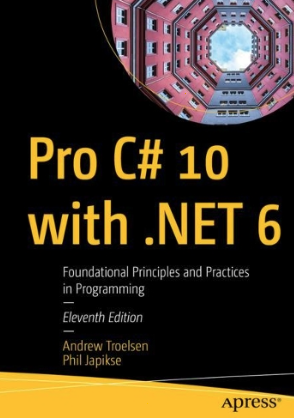

# Вступ до курсу «OOP on top of C#»

## На що звернути увагу

- Цей курс підійде вам, якщо ви вже знайомі з базовим синтаксисом C#.
- Лекція, конспект і код — це три шари однієї теми, які варто вивчати разом.
- У нас є два плани лабораторних робіт: загальний та індивідуальний. Зверніть увагу, що їхні номери можуть не збігатися.
- Оцінка формується так: 61 бал ви отримуєте за лабораторні роботи, а 39 балів — за екзамен.

## Спробуйте самі

- Відкрийте [презентації](../presentations/index.html) у своєму браузері.
- Прочитайте цей конспект і розділ про те, [як користуватися матеріалами](#як-користуватися-матеріалами).
- Перевірте, який у вас план лабораторних: [загальний](../labs/general/README.md) чи [індивідуальний](../labs/individual/README.md).

## Пов’язані лабораторні

Лабораторні роботи ви виконуєте окремо від лекції. Ми почнемо з абстракцій та інкапсуляції.

---

## Для кого цей курс

Ви вже вмієте працювати з консоллю, створювати типи, методи та масиви. У цьому курсі ми підемо глибше: розглянемо чотири стовпи ООП, generics, відносини між об’єктами, SOLID, DI, патерни GoF, колекції, потоки й сучасний синтаксис C#.

Класичне ООП — це стара й дуже популярна парадигма. Її основи були закладені ще на початку 1960-х років (об’єкти в LISP). Більшість сучасних мов програмування підтримують ООП зі своїми особливостями. C# був розроблений як мова із сильною підтримкою ООП — це фундамент платформи, а не просто «опція збоку».

## Як користуватися матеріалами

На кожну тему я підготував для вас три складові. Використовуйте їх разом, а не лише переглядайте слайди.

1. **Презентація** — це короткі слайди. Відкрийте [index.html](../presentations/index.html) у браузері. Для навігації використовуйте клавіші ← →, пробіл; O — для огляду, F — для повного екрана.
2. **Конспект** — це той самий матеріал, але розгорнуто, з кодом і посиланнями на лабораторні роботи.
3. **Код** — це консольний проєкт у папці `code/lecture-NN-...`. Інструкцію із запуску ви знайдете в [code/README.md](../../code/README.md).

Якщо ви навчаєтесь за індивідуальним планом, ви будете детальніше проходити раннє ООП (матимете окремі роботи на інтерфейси та default interface methods). Перелік лекцій для всіх залишається однаковим.

## Як формується оцінка

Ваша робота на курсі оцінюється за **100-бальною** шкалою.

- **61 бал** — ви отримаєте за всі лабораторні роботи з вашого плану.
- **39 балів** — виділено на екзамен: він складатиметься із запитань з тем курсу та невеликого практичного завдання, яке ви покажете наживо.

## Джерела

Користуйтеся цими джерелами, коли хочете зануритися в тему глибше, ніж це дозволяє лекція.

1. *Pro C# 10 with .NET 6: Foundational Principles and Practices in Programming*

   

2. [Документація Microsoft: C# fundamentals](https://learn.microsoft.com/en-us/dotnet/csharp/fundamentals)
3. [Microsoft Learn / академія C#](https://dotnet.microsoft.com/en-us/learn/csharp)
4. [Патерни українською (krypton.com.ua)](https://krypton.com.ua/rozdil-1-osnovy-paterniv-proektuvannya/)
