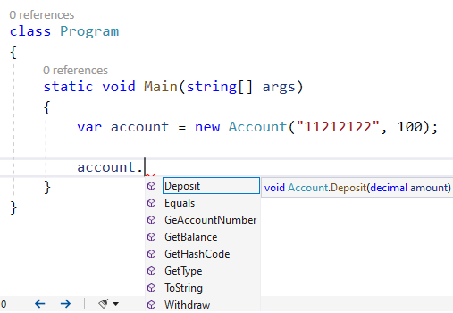

# Теорія ООП

## На що звернути увагу

Під час лекції зверніть увагу на те, як абстракція допомагає моделювати об’єкти реального світу. Ви дізнаєтеся, як інкапсуляція захищає дані, а наслідування дозволяє перевикористовувати код. Також ми розберемо поліморфізм, механізми upcast і downcast, а наприкінці познайомимося з розширювальними методами, делегатами, ключовим словом yield та основами LINQ.

## Спробуйте самі

Спробуйте самостійно створити абстракції на базі геометричних фігур та використати інтерфейси як контракти. Реалізуйте інкапсуляцію на прикладі банківського рахунку, використовуючи властивості та методи Get/Set. Попрактикуйтеся з перевантаженням методів, абстрактними й віртуальними методами, а також дослідіть поліморфізм на класах фігур. Перевірте, як працюють upcast і downcast на практиці. Напишіть власні розширювальні методи та спробуйте застосувати підхід TDD, виконавши завдання string calculator kata.

## Пов’язані лабораторні

- [Загальний план, №1–6, 9–10](../labs/general/README.md)
- [Індивідуальний план, №1–8, 10, 13](../labs/individual/README.md)

Усі приклади коду до слайдів ви знайдете в директорії `code/lecture-01-oop-theory`.

---

## Абстракція і моделювання об’єктів реального світу

Абстракція - це один з принципів ООП, що використовується для приховування деталей імплементації та описує лише найголовніші характеристики об’єкту. Іншими словами, ви фокусуєтеся лише на необхідних характеристиках чи атрибутах, ігноруючи не важливі деталі. Головна суть абстракції - спростити розуміння об'єкта, не заглиблюючись в деталі імплементації.

У мові програмування C# абстракції будуються за допомогою абстрактних класів та інтерфейсів.

### Абстрактні класи

Абстрактний клас в C# має містити модифікатор abstract, який вказує компілятору на те, що метод буде містити часткову чи відсутню реалізацію. Розгляньмо приклад, де нам потрібно змоделювати абстрактну фігуру, про яку ми нічого не знаємо, але хочемо мати можливість обрахувати її площу:

```csharp
using System;

namespace Abstract_class
{
    // оголошуємо абстрактний клас, вказуючи модифікатор abstract
    abstract class Shape
    {
        // повертає площу фігури
        public abstract int GetArea();
    }

    // оголошуємо конкретну реалізацію класу прямокутник, який породжений від абстрактної фігури
    class Square : Shape
    {
        // оголошуємо змінну, яка зберігатиме розмір сторони прямокутника 
		    private readonly int sideSize;

        // реалізуємо конструктор прямокутника, який встановлює сторону прямокутника 
        public Square(int size) => sideSize = size;

        // реалізуємо метод для отримання площі прямокутника. 
        // УВАГА: модифікатор override необхідний для розширення чи зміни реалізації абстрактного методу
        public override int GetArea() => sideSize * sideSize;       
    }

    class Program
	  {
        static void Main(string[] args)
        {
            Console.WriteLine("Please enter square size: ");
            var inputSize = Console.ReadLine();

            // обовязково перевіряємо / валідуємо вхідні дані
            if (int.TryParse(inputSize, out var sideSize))
            {
                var square = new Square(sideSize);
                Console.WriteLine($"Square's area = { square.GetArea() }");
            }
            else
			      {
                Console.WriteLine("Only digits are allowed!");
            }
        }
	  }
}
```

Абстрактні класи мають наступні характеристики:

- Не можна створювати екземпляри абстрактних класів
- Абстрактний клас може мати абстрактні методи та властивості
- Не абстрактний клас, який наслідує абстрактний клас, має реалізувати всі абстрактні методи та властивості
- [Не можна використовувати модифікатор abstract для статичних властивостей чи методів, оскільки статичні методи і властивості відносяться до типу, а не до екземпляру об'єкта.](https://stackoverflow.com/questions/3284/why-cant-i-have-abstract-static-methods-in-c)

Розгляньмо приклад точки зі зміщенням на базі абстрактних координат, яка може бути використана при створення аркадної гри:

```csharp
using System;
using System.Collections.Generic;

namespace Abstract_properties
{
	// оголошуємо клас абстрактної точки
	abstract class BasePoint
	{
		protected int xCoord = 0;
		protected int yCoord = 0;

		// оголошуємо абстрактний метод для встановлення координат
		public abstract void SetCoords(int x, int y);

		// оголошуємо абстрактні властивості
		public abstract int X { get; }
		public abstract int Y { get; }
	}

	// конкретна імплементація точки зі зміщенням
	class OffsetPoint : BasePoint
	{
		// зміщення точки
		const int Offset = 10;

		// реалізуємо конструктор, який встановлює координати через метод SetCoords 
		public OffsetPoint(int x, int y) => SetCoords(x, y);

		// реалізуємо конкретний метод для встановлення координат
		public override void SetCoords(int x, int y)
		{
			// Правило хорошого тону: внутрішній стан обєкта має лишатися без змін
			xCoord = x;
			yCoord = y;
		}

		// реалізуємо властивість X яка повертає координати точки зі зміщенням Offset
		public override int X 
		{
			get
			{
				// Правило хорошого тону: оперуємо лише представленням даних
				return xCoord + Offset;
			}
		}

		// реалізуємо властивість Y яка повертає координати точки зі зміщенням Offset
		public override int Y => yCoord + Offset;		

		// реалізуємо метод ToString який повертає координати зі зміщенням як текстовий рядок 
		public override string ToString()
		{
			return $"x,y = [{X}, {Y}]";
		}
	}

	class Program
	{
		static void Main(string[] args)
		{
			// створюємо список точок зі зміщенням
			var points = new List<OffsetPoint>();
			for(int i = 0; i < 5; i++)
			{
				if (points.Count == 0)
				{
					points.Add(new OffsetPoint(0, 0));
				}
				else
				{
					// кожна наступна точка зміщена відносно попередньої
					var previousPoint = points[i - 1];
					points.Add(new OffsetPoint(previousPoint.X, previousPoint.Y));
				}

				// виводимо поточну точку в консоль
				var currentPoint = points[i];
				Console.WriteLine(currentPoint.ToString());
			}
		}
	}
}
```

- **DepositAccount -** має містити метод що, збільшує суму депозиту відповідно до ставки
- **CurrentAccount -** має містити метод для встановлення кредитного ліміту, який має враховуватися при знятті коштів

**Протестуйте роботу всіх класів з виведенням в консоль.**

### **Інтерфейси**

При оголошенні інтерфейсу, ви можете вказувати методи, властивості, індексатори та події (events). В останніх версіях C# інтерфейси також підтримують реалізацію за замовчуванням. Розгляньмо приклад нижче, який показує інтерфейси як контракти:

 

```csharp
using System;
using System.Linq;

namespace Interfaces
{
    // оголошуємо контракт для калькулятора площі фігури
    interface IShapeAreaCalculator
    {
        // повертає площу фігури
        public double GetArea();
        public string WhoAmI { get; }
    }

    // оголошуємо конкретну реалізацію класу прямокутник, який унаслідуваний від інтерфейса калькулятора площі
    class Square : IShapeAreaCalculator
    {
        // оголошуємо змінну, яка зберігатиме розмір сторони прямокутника 
        private readonly int sideSize;

        // реалізуємо конструктор прямокутника, який встановлює сторону прямокутника 
        public Square(int size) => sideSize = size;

        public string WhoAmI => this.GetType().ToString();

        // реалізуємо метод для отримання площі прямокутника.         
        public double GetArea() => sideSize * sideSize;
    }

    // оголошуємо конкретну реалізацію класу Коло, який унаслідуваний від інтерфейса калькулятора площі
    class Circle : IShapeAreaCalculator
    {        
        private readonly int radius;

        // реалізуємо конструктор кола, який встановлює радіус
        // this - вказує на поточний інстанс класу
        public Circle(int radius) => this.radius = radius;

		    public string WhoAmI => this.GetType().ToString();

		    public double GetArea() => Math.PI * Math.Pow(radius, 2);
    }

    class Program
    {
        static void Main(string[] args)
        {
            Circle circle = new Circle(10);
            Square square = new Square(10);

            Console.WriteLine($"Cirle area: {circle.GetArea()} Square area: {square.GetArea()}");

            // УВАГА: не можна інстанціювати інтерфейс чи абстрактний клас!
            // Error CS0144  Cannot create an instance of the abstract type or interface 'IShapeAreaCalculator'
            // IShapeAreaCalculator shape = new IShapeAreaCalculator();

            // з іншої сторони, якщо є контракт і ми працюємо лише з абстракцією,
            // то не важливо "хто" саме підтримує даний контракт
            // більше того, в runtime ми можемо і не знати хто саме імплементував контракт, нам лише важливо знати
            // що контракт підтримується, як показано нижче

            IShapeAreaCalculator shapeAreaA = circle;
            IShapeAreaCalculator shapeAreaB = square;

            Console.WriteLine($"Area A: {shapeAreaA.GetArea()} Area B: {shapeAreaB.GetArea()}");

            // виведемо в консоль назву типу, який стоїть за кулісами інтерфейсних змінних
            Console.WriteLine($"surprise surprise, I am - {shapeAreaA.WhoAmI }");
            Console.WriteLine($"surprise surprise, I am - {shapeAreaB.WhoAmI }");

            // заповнюємо масив, але відвязуємося від конкретної імплементації 
            const int arraySize = 5;
            var shapes = new IShapeAreaCalculator[arraySize];
            var rnd = new Random();

            for (int i = 0; i < arraySize; i++)
            {
                // не знаємо який тип буде через генератор випадкових чисел
                if (rnd.Next(10) % 2 != 0)
                {
                    shapes[i] = new Square(i);
                }
                else
                {
                    shapes[i] = new Circle(i);
                }
            }

            // виводимо назву типу та загальну площу всіх фігур
            double totalArea = 0;
            foreach(var item in shapes)
			      {
                Console.WriteLine($"Shape: - {item.WhoAmI }");
                totalArea += item.GetArea();
            }

            Console.WriteLine($"Total area: {totalArea}");
        }
    }
}
```

**315 сторінка Pro C#**

При проектуванні складних бібліотек та API інколи необхідно лишити конкретну реалізацію частини коду, яка буде доступна в усіх хто реалізує контракт, але все одно опиратися на підхід абстракції. Для цього в нових версіях C# існує [реалізація за замовчуванням](https://learn.microsoft.com/en-us/dotnet/csharp/language-reference/proposals/csharp-8.0/default-interface-methods). Розгляньмо приклад нижче:

```csharp
using System;
using System.Linq;
using System.Text.RegularExpressions;

namespace Default_interface_methods
{
	// оголошуємо контракт для безпечного читання карток  
	interface ISecureCardReader
	{
		// оголошуємо 3 методи які будуть реалізовані в конкретних імплементаціях
		void InitializeCardReader();

		void CloseCardReader();

		string NativeRead();

		// реалізуємо поведінку по замовчуванню, яка базується на абстракціях 
		// які будуть реалізовані в конкретних класах
		string SecureRead()
		{
			InitializeCardReader();

			var cardNumber = NativeRead();

			// використовуючи регулярний вираз, приховуємо перших 4 символа номера картки
			int numberOfSymbolsToReplace = 4;						
			string pattern = @"^.{" + numberOfSymbolsToReplace + "}";

			string result = Regex.Replace(cardNumber, pattern, new string('*', numberOfSymbolsToReplace));

			CloseCardReader();

			return result;
		}
	}

	// конкретна реалізація ISecureCardReader з своєю логікою
	class MagneticCardReader : ISecureCardReader
	{
		public void CloseCardReader()
		{
			Console.WriteLine("Close card reader");
		}

		public void InitializeCardReader()
		{
			Console.WriteLine("Initialize card reader");
		}

		public string NativeRead()
		{
			return Console.ReadLine();
		}
	}

	class Program
	{	
	  static void Main(string[] args)
		{
			// ми нічого не знаємо про конкретну імплементацію, маємо лише інтерфейс який на неї посилається			
			ISecureCardReader cardReader = GetCardReader();

			// викликаємо метод, який зробить всю рутину і поверне безпечний номер картки
			var cardNumber = cardReader.SecureRead();

			Console.WriteLine($"Secure string: {cardNumber}");
		}

		// даний метод треба лише для прикладу, що ми не знаємо про конкретну імплементацію
		static ISecureCardReader GetCardReader()
		{
			return new MagneticCardReader();
		}
	}
}
```

💡 **Рефакторинг** ([англ.](https://uk.wikipedia.org/wiki/%D0%90%D0%BD%D0%B3%D0%BB%D1%96%D0%B9%D1%81%D1%8C%D0%BA%D0%B0_%D0%BC%D0%BE%D0%B2%D0%B0) *refactoring*) — процес редагування [програмного коду](https://uk.wikipedia.org/wiki/%D0%9F%D1%80%D0%BE%D0%B3%D1%80%D0%B0%D0%BC%D0%BD%D0%B8%D0%B9_%D0%BA%D0%BE%D0%B4), внутрішньої структури [програмного забезпечення](https://uk.wikipedia.org/wiki/%D0%9F%D1%80%D0%BE%D0%B3%D1%80%D0%B0%D0%BC%D0%BD%D0%B5_%D0%B7%D0%B0%D0%B1%D0%B5%D0%B7%D0%BF%D0%B5%D1%87%D0%B5%D0%BD%D0%BD%D1%8F) для полегшення розуміння коду та внесення подальших правок без зміни зовнішньої поведінки самої системи

## **Інкапсуляція**

Інкапсуляція приховує внутрішні дані та деталі реалізації об’єкту від зовнішнього світу, надаючи доступ до них лише через публічний інтерфейс (під інтерфейсом маємо на увазі методи та властивості). Цей принцип дозволяє використовувати клас без розуміння деталей його реалізації, що **значно спрощує складність** програмного забезпечення.

Інкапсуляція в C# реалізована за допомогою модифікаторів доступу, які включають публічні (*public)*, приватні (*private, private protected)*, внутрішні (*internal)*, та захищені (*protected)* і контролюють доступ та видимість членів класу.

```csharp
using System;

namespace Encapsulation
{
    public class Account
    {
        // не надаємо доступ до змінних за допомогою модифікатора доступу private
        private string accountNumber;
        private decimal balance;

        // конструктор виступає публічним інтерфейсом для ініціалізації балансу та номером рахунку
        public Account(string accountNumber, decimal balance)
        {
            this.accountNumber = accountNumber;
            this.balance = balance;
        }       

        public void Deposit(decimal amount)
        {
            // деталі реалізації не доступні кінцевому споживачу
            balance += amount;
        }

        public void Withdraw(decimal amount)
        {
			    // деталі реалізації не доступні кінцевому споживачу
			    if (balance < amount)
			    {
				     throw new Exception("Insufficient funds. Please check balance");
			    }
			    else
			    {
			       balance -= amount;
			    }
		    }

        // інші публічні інтерфейси
        public string GeAccountNumber()
        {
            return accountNumber;
        }

        public decimal GetBalance()
        {
            return balance;
        }
    }

  class Program
	{
		 static void Main(string[] args)
		 {
        var account = new Account("11212122", 100);

        account.Withdraw(10);

        Console.WriteLine($"Account balance {account.GetBalance()}");

        account.Withdraw(1000);
     }
   }
}

```



Зверніть увагу на знімок екрана вище. Приватні члени класу недоступні в клієнтському коді, а лише публічні (public). Тобто ви можете здійснювати доступ лише через публічний інтерфейс. Зазвичай методи публічного інтерфейсу, які оперують внутрішнім станом об’єкту, починають свою назву з префіксу Get \ Set, за що їх і називають гетери \ сетери.

Тепер розгляньмо приклад нижче, де ми також використаємо властивості замість `GeAccountNumber` та `GetBalance`

```csharp
using System;

namespace Encapsulation
{
    public class Account
    {
        // не даємо доступ до змінних за допомогоюмодифікатора доступу private
        private string accountNumber;
        private decimal balance;

        // конструктор виступає публічним інтерфейсом для ініціалізації балансу та номером рахунку
        public Account(string accountNumber, decimal balance)
        {
            this.accountNumber = accountNumber;
            this.balance = balance;
        }

        public void Deposit(decimal amount)
        {
            // деталі реалізації не доступні кінцевому споживачу
            balance += amount;
        }

        public void Withdraw(decimal amount)
        {
            // деталі реалізації не доступні кінцевому споживачу
            if (balance < amount)
            {
                throw new Exception("Insufficient funds. Please check balance");
            }
            else
            {
                balance -= amount;
            }
        }

        // вказуємо властивість, яка доступна лише для читання (readonly)
        public string AccountNumber
        {
            get
            {
                return accountNumber;
            }
        }

        public decimal Balance
        {
            get
            {
                return balance;
            }
        }
    }

    class Program
    {
        static void Main(string[] args)
        {
            var account = new Account("11212122", 100);

            account.Withdraw(10);

            Console.WriteLine($"Account number {account.AccountNumber} balance {account.Balance}");

            account.Withdraw(1000);
        }
    }
}

```

Як бачимо з прикладу вище, властивості доступні лише для читання і з ними зручніше працювати в клієнтському коді. Також ми можемо скоротити реалізацію властивостей до найновішої версії:

```csharp

public string AccountNumber => accountNumber;

public decimal Balance => balance;
```

Основна ідея в тому, що тепер ви можете контролювати встановлення та читання даних. Розгляньмо приклад нижче, який показує додаткову бізнес-логіку під час читання чи запису властивостей:

```csharp
using System;

namespace Encapsulation
{
    public class XCoord
    {
        // не даємо доступ до змінних за допомогою модифікатора доступу private
        private int x;

        // конструктор виступає публічним інтерфейсом для ініціалізації XCoord
        public XCoord(int x)
        {
            this.x = x;            
        }

        // додаємо бізнес логіку для властивості
        public int X
        {
            get
            {
                return x;
            }
            set
			      {
                // value - це значення,яке ми хочемо присвоїти для властивості з зовні
                if (value > 0)
				        {
                    x = value;
				        }
                else
				        {
                    throw new ArgumentException($"value {value} is invalid for X-coord. Use positive only.");
				        }
			      }
        }
    }

    class Program
    {
        static void Main(string[] args)
        {
            var xcoord = new XCoord(124);

            // встановлюємо коректне значення X 
            xcoord.X = 10;

            Console.WriteLine($"X : {xcoord.X}");

            // встановлюємо не коректне значення X і отримуємо
            // System.ArgumentException: value -1 is invalid for X-coord. Use positive only
            xcoord.X = -1;
        }
    }
}
```

Варто зазначити, що якщо ми оголосимо публічну властивість, то це не буде порушення інкапсуляції, оскільки ми зажди можемо додати логіку читання \ запису, на відміну від оголошення публічної змінної, до якої матиме прямий доступ будь-який клієнтський код.

```csharp
using System;

namespace Encapsulation
{
    public class Point
    {
        // порушення інкапсуляції, оскільки надаємо публічний доступ до стану
        public int X;

        // публічна властивість не порушує інкапсуляцію 
        public int Y { get; set; }

        // конструктор виступає публічним інтерфейсом для ініціалізації Point
        public Point(int x, int y)
        {
            X = x;
            Y = y;
        }       
    }

    class Program
    {
        static void Main(string[] args)
        {
            var point = new Point(1, 2);

            DoSomethingWithPoint(point);

            point.Y = 1;

            // порушення інкапсуляції, оскільки ми втратили контроль над внутрішнім станом
            point.X = 10;          

        }

        static void DoSomethingWithPoint(Point point)
		    {
            point.Y = point.Y + 10;

            // порушення інкапсуляції, оскільки клієнтський код має контроль над внутрішнім станом
            point.X = point.X + 1;
        }
    }
}
```

- **HeatWater -** приватний метод, який підігріває воду
- **GrindBeans -** приватний метод, який меле вказану кількість кави та перевіряє чи її досить в кавовій машині
- **MakeEspresso** - публічний метод, якому потрібно 20 грам кавових зерен, щоб зробити порцію
- **MakeLatte** - публічний метод, якому потрібно 25 грам кавових зерен, щоб зробити порцію

- **ILoginProvider -** має метод bool Validate(string login, string password)
- **GmailAuthProvider -** має конструктор, який приймає gmail пошту та пароль
- **Privat24AuthProvider**- має конструктор, який приймає номер телефону та пароль до банкінгу
- **DigitalWallet** - має методи як: List<string> GetTransactionLog(), decimal CheckBalance(), bool Withdraw(decimal amount), void Deposit(decimal amount), void SetAuthProvider(**ILoginProvider authProvider**)

## Наслідування / Спадковість

Наслідування надає можливість використовувати програмний код іншого класу (його називають базовим / батьківським) та доповнювати його своїми деталями реалізації. Тобто, наслідувальники можуть користуватися кодом базового класу. Наслідувальників зазвичай називають похідними або дочірніми класами (”derived” or “child” class).

За допомогою наслідування ви можете не лише успадковувати властивості та методи, використовуючи код повторно, а й будувати ієрархічні відносини між класами.

Ось декілька основних характеристик наслідування в контексті мови програмування C#:

- **Базовий клас** - це клас, члени якого наслідуються іншим класом
- **Похідний клас** - це клас, який наслідує члени від базового класу. Додатково може додавати свої члени та переписувати логіку роботи базового класу.
- **Ланцюжок наслідування** - це клас, який може бути наслідуваний від іншого класу, який теж наслідується ще від іншого, що призводить до ланцюгової ієрархії
- **Модифікатори доступу** - в дочірньому класі ми можемо доступитися тільки до членів базового класу з модифікаторами доступу: публічні, захищені (protected) та внутрішні (internal). Приватні члени базового класу не доступні.
- **Перевизначення методів** - як метод базового класу має модифікатор virtual, похідний клас може переписати даний метод за допомогою ключового слова override. Це дозволяє наслідувальнику мати свою власну реалізацію.
- Ключове слово **base** -  в середині дочірнього класу ми можемо звертатися до членів батьківського класу за допомогою ключового слова **base** (по аналогії як **this** дозволяє доступитися до самого себе)
- **Запечатані (sealed) класи** - можемо заборонити наслідування за допомогою ключового слова sealed.

‼️ C# на відміну від C++, не підтримує множинне наслідування від класів, проте ми можемо наслідуватися (чи краще сказати - реалізувати контракт) від багатьох інтерфейсів.

Розгляньмо наступний приклад:

```jsx
using System;

namespace SimpleInheritance
{
    // оголошуємо базовий клас
    public class Person
    {
        public string Name { get; set; }
        public int Age { get; set; }
        public string Address { get; set; }

        // як завжди оголовшуємо консnруктор
        public Person(string name, int age, string address)
        {
            Name = name;
            Age = age;
            Address = address;
        }

        // метод базового класу, доступний для наслідників
        public void Display()
        {
            Console.WriteLine(ToString());
        }

        // маємо змогу перевизначити метод ToString. Чому?
        // Тому що, всі класи класи в c# породжені від класу Object
        // який містить віртуальний метод ToString() 
        // https://learn.microsoft.com/en-us/dotnet/api/system.object.tostring?view=net-8.0
        public override string ToString()
        {
            return $"Name: {Name}, Age: {Age}, Address: {Address}";
        }
    }

    // оголошуємо наслідника, який використовує базові властивості батьківського класу і додає свої
    public class Student : Person
    {
        // властивість StudentEmail доступна для запису лише в середині Student  
        public string StudentEmail { get; private set; }

        public Student(string name, int age, string address, string email)
            : base(name, age, address) // !! викликаємо конструктор базового класу
        {
            StudentEmail = email;
        }

        // реалізуємо метод, який використовує батьківські властивості та свої
        public void Enroll(string courseName)
        {
            Console.WriteLine($"{Name} with email {StudentEmail} has enrolled in {courseName} course.");
        }
    }

    // ще один похідний клас
    public class Teacher : Person
    {
        public string EmployeeId { get; set; }

        public Teacher(string name, int age, string address, string employeeId)
            : base(name, age, address) // !! викликаємо конструктор базового класу
        {
            EmployeeId = employeeId;
        }

        // спеціалізований метод викладача, ніхто ніший не знає про нього
        public void Teach(string courseName)
        {
            Console.WriteLine($"{Name} is teaching {courseName} course.");
        }

        public void DisplayTeacher()
        {
            // звертаємося до базового класу
            Console.WriteLine($"{base.ToString()}, EmployeeId: {EmployeeId}");
        }

    }

    public class Program
    {
        static void Main(string[] args)
        {
            // створюємо екзмепляри наслідників
            var andrii = new Student("Andrii Stepanchuk", 20, "12 Mazepy St", "andrii.stepanchuk@edu.oa.com");
            andrii.Display();
            andrii.Enroll("OOP");

            Console.WriteLine();
            Teacher meol = new Teacher("Melnychuk Oleksandr", 37, "25 Skovorody St", "TCH37OM");
            meol.Display();
            meol.Teach("Robotics");

            // спеціалізований метод наслідника, базовий клас про нього нічого не знає
            meol.DisplayTeacher();

            Console.ReadLine();
        }
    }
}

```

- Реалізуйте консольне меню для користувача та адміністратора.
- Реалізуйте можливість виставляти націнку на автомобіль для користувача.
- Винесіть базові характеристики автомобіля в батьківський клас.
- Реалізуйте пошук автомобілів для користувача в інших автосалонах через інтерфейс **ICarDealer**.

## Поліморфізм

**Поліморфізм** — це концепція програмування, яка дозволяє обробляти об’єкти різних типів так, ніби вони належать до одного типу, і по-різному реагувати на одні й ті самі методи чи функції. Об’єкти **можуть набувати різних форм залежно від контексту, в якому вони використовуються.** Назва походить з грецької, що означає “πολύς «багато» + μορφή «форма»”

[Поліморфізм у C#](https://learn.microsoft.com/en-us/dotnet/csharp/fundamentals/object-oriented/polymorphism) дозволяє класу мати багато імплементацій з однаковою назвою. 

В C# існує 2 види поліморфізму:

- статичний (на етапі компіляції), відбувається через:
    - перевантаження методів (method overloading)
    - перевантаження операторів (operator overloading)
- динамічний (на етапі виконання) відбувається через перевизначення віртуальних методів (virtual / overriding methods)

Розгляньмо наступний приклад статичного поліморфізму на основі перевантаження методів.

```csharp
public class SimpleCalculator
{
    public int Add(int a, int b, int c)
    {
        return a + b + c;
    }
    
    public int Add(int a, int b)
    {
        return a + b;
    }
    
    public double Add(double a, double b)
    {
        return a + b;
    }
}
class Program
{
    static void Main(string[] args)
    {
        var calc = new SimpleCalculator();
        
        // компілятор обирає необхідний метод на етапі компіляції 
        int addThree = calc.Add(1, 2, 3);
        
        int addTwo = calc.Add(2, 5);
        
        double addTwoDouble = calc.Add(2.1, 5.7);
    }
}
```

Як бачимо вище, компілятор може і знаходить відпвідний метод який відповідає переденам в нього параметрам.

Розгляньмо приклад нижче, який пояснить принцип динамічного поліморфізму:

```csharp
// базовий клас який визначає форму фігури
public class Shape
{	
  	protected ConsoleColor BorderColor { get; set; }

    // позначаємо метод як віртуальний
    public virtual void Draw()
    {
        Console.BackgroundColor = ConsoleColor.Black;
        Console.WriteLine($"Base class drawing with color: {BorderColor}");
    }

    // довзоляємо встановити колір лише з похідного класу
    protected void SetBackgroundColor()
		{
        Console.BackgroundColor = BorderColor;
		}
 }

 public class Rectangle : Shape
 {
		public Rectangle(ConsoleColor borderColor)
    {
        Height = 10;
        Width = 20;
        BorderColor = borderColor;
    }

		public int Height { get; set; }
    public int Width { get; set; }

    // переписуємо віртуальний метод базового класу
    // своєю власною реалізацією
    public override void Draw()
    {
        // викликаємо батьківський метод, що дозволяє встановити колір тексту
        SetBackgroundColor();

        // малюємо прямокутник 
        for (int y = 0; y < Height; y++)
        {
             for (int x = 0; x < Width; x++)
             {
                  Console.Write("*");
             }

             Console.WriteLine();
         }

         // викликаємо базовий метод для малювання від батьківського класу
         base.Draw();
     }
  }
  
	public class Triangle : Shape
	{
      public int Height { get; set; }
      public int Length { get; set; }

      public Triangle(ConsoleColor borderColor)
		  {
          Height = 10;
          Length = 20;
          BorderColor = borderColor;
      }

       // переписуємо віртуальний метод базового класу
       // своєю власною реалізацією
		   public override void Draw()
		   {
            // викликаємо батьківський метод, що дозволяє встановити колір тексту
            SetBackgroundColor();
            var peakStart = Length;
            var peakEnd = Length;

            // малюємо трикутник
            for (int h = 0; h < Height; h++)
            {
                for (int s = 0; s < 2 * Length + 1; s++)
                {
                    if (peakStart < 1.5 * Length
                        && s >= peakStart 
                        && s <= peakEnd)
                    {
                        Console.Write("*");
                    }
                    else
                    {
                        Console.Write(" ");
                    }
                }
                peakStart--;
                peakEnd++;
                Console.WriteLine("");
            }

            // викликаємо базовий метод для малювання від батьківського класу
            base.Draw();
		   }
	}
	
	class Program
    {
        static void Main(string[] args)
        {
            // список з фігур, для чистоти експерименту можна запитати тип фігури з консолі
            var shapes = new List<Shape>
            {
                new Rectangle(ConsoleColor.Blue),
                new Triangle(ConsoleColor.Yellow),
            };

            // динамічний поліморфізм!
            // робимо виклик метода базового класу Shape, 
            // але викликаний буде метод Draw конкретного наслідника
            foreach (var shape in shapes)
            {
                shape.Draw();
            }
        }
    }
```

Інколи є необхідність заборонити переписування віртуальних методів базового класу в наслідниках, для того використовують ключове слово sealed

```csharp
 public sealed override void Draw()
 {
 ....
 }
```

Це означає, що всі наслідникі змушені будуть використовувати лише базову реалізацію. При спробі перевизначити метод Draw, компілятор вкаже на помилку.

### Upcast і downcast

Поліморфізм тримається на **upcast**: змінна базового типу вказує на об’єкт нащадка. Це завжди безпечно і часто неявно.

**Downcast** — зворотний напрямок: з батька знову зробити нащадка. Компілятор цього не гарантує, тож у runtime можна спіймати `InvalidCastException`. Безпечніше — `is` і `as`.

```csharp
Shape s = new Square(3);          // upcast, неявно
Square sq = (Square)s;            // downcast, явно; впаде, якщо s не Square
Square? ok = s as Square;         // null, якщо тип не той
if (s is Square square)
{
    Console.WriteLine(square.GetArea());
}
```

Cast value type ↔ `object` — це вже **boxing**. Наступна лекція, разом із generics.

## Розширювальні методи

Дозволяють додавати методи до існуючих типів та класів після їх компіляції. Розширення відбувається без створення похідного типу, а на базі статичних методів.

Ось декілька основних нюансів:

- Розширювальний метод повинен бути визначений у статичному класі. Перший параметр методу вказує тип, до якого метод буде "додаватись", і цей параметр повинен бути позначений ключовим словом this.
- Розширювальні методи викликаються так, як ніби вони є частиною визначення типу, до якого вони додаються.
- Якщо існуючий тип вже має метод із таким самим ім'ям і сигнатурою, як у розширювального методу, то метод існуючого типу матиме пріоритет, і розширювальний метод ігноруватиметься.
- Розширювальні методи можуть бути використані для додавання функціональності до класів, інтерфейсів, структур та навіть до примітивних типів даних.

Розгляньмо приклад нижче:

```csharp
  // правилом хорошого тону буде назва класу яка спочатку вказуватиме на тип, який розширюємо
	public static class StringExtension
	{
		// ключове слово this вказує тип до якого буде додаватися метод
		// в даному прикладі це тип sring
		public static string[] ToWords(this string str)
		{
			return str.Split(new char[] { ' ', '.', '?' }, StringSplitOptions.RemoveEmptyEntries);
		}

		// розширювальний метод який повертає кількість слів в реченні
		public static int WordsCount(this string str)
		{
			return str.ToWords().Length;
		}

		// розширювальний метод який повертає першу букву кожного слова
		public static List<char> WordsFirstCharacters(this string str)
		{
			var characters = new List<char>();
			const int firstCharIndex = 0; 

			foreach(var word in str.ToWords())
			{
				characters.Add(word[firstCharIndex]);
			}

			return characters;
		}
	}

	public class Program
	{
		public static void Main()
		{
			var str = "I am software developer? Am I?";

			// можемо викликати розширювальний метод від екземпляру класа
			int count = str.WordsCount();

			var firstLetters = str.WordsFirstCharacters();

			var result = string.Join(" ", firstLetters);

			Console.WriteLine($"Words count: {count}");
			Console.WriteLine($"Words first letters: {result}");
		}
	}
```

Як видно з прикладу вище, ми можемо створювати безліч розширювальних методів в одному статичному класі. Але краще створювати окремий статичний клас під тип конкретний тип розширення.

Одним з найкращих прикладів використання розширювальних методів є технологія LINQ про яку йдеться нижче.

- Реалізуйте метод, що повертає кількість цифр у числі.
- Реалізуйте метод, що перевіряє, чи число парне.
- Реалізуйте метод, що перевіряє, чи число непарне.
- Реалізуйте метод, що перевіряє, чи число більше за вказане.
- Реалізуйте метод, що перевіряє, чи число менше за вказане.
- Реалізуйте метод, що перевіряє, чи число рівне вказаному.

## LINQ

(**L**anguage-**In**tegrated **Q**uery) мова вбудованих запитів.

Дає вам змогу писати чистіший та надійніший код запитів незалежно від джерела даних.

Під капотом LINQ  базується на 3 можливостях c#, а саме:

- розширювальні методи
- делегати
- ключове слово yield

**Делегати**

Делегат - це тип даних, який інкапсулює посилання на метод з вказаним списком аргументів та типом що повертається. Оскільки делегат — це тип, ви можете передавати його в методи і використовувати як так звані зворотні виклики (callbacks). Розгляньмо приклад нижче, щоб зрозуміти, навіщо потрібен тип делегат:

```csharp
public class CardNumberMask
	{
		public string Mask(string cardNumber)
		{
			var groups = new List<string>();

			// номер картки записаний без пробілів ділимо зі зміщенням 4 по 4
			const int groupSize = 4;
			for (int i = 0; i < cardNumber.Length; i += groupSize)
			{
				groups.Add(cardNumber.Substring(i, groupSize));
			}

			// показуємо лише перші 4 та останні 4 номери картки
			int firstGroupIndex = 0;
			int lastGroupIndex = groups.Count - 1;
			return $"{groups[firstGroupIndex]} **** **** {groups[lastGroupIndex]}";
		}
	}

	public class Program
	{
		public static void Main()
		{
			var mask = new CardNumberMask();
			var cards = new List<string>
			{
				"1111222233334444",
				// "1121 2322 3637 5555", - такий формат вже не спрацює, треба змінювати метод маскування
				// "2111-2222-3637-5555" - такий теж не спрацює, ще раз треба модифікувати метод маскування
			};

			foreach (var card in cards)
			{
				var masked = mask.Mask(card);

				Console.WriteLine(masked);
			}
		}
	}
```

Як бачимо, кожний новий формат номеру картки вимагає зміну методу маскування, що є дуже не зручним і наш метод не є відкритим до розширення і потребує нової версії для підтримки кожного нового формату картки. Щоб уникнути такої незручності, використаємо тип делегат для обробки формату каркти:

```csharp
public class CardNumberMask
{
		// оголошуємо тип делегат, який приймає рядок і повертає список рядків
		public delegate List<string> ParseCardNumber(string cardNumber);

		// метод приймає ParseCardNumber делегат як аргумент
		public string Mask(string cardNumber, ParseCardNumber parseCardNumber = null)
		{
			var groups = new List<string>();

			// якщо користувач вказав свій делегат
			if (parseCardNumber != null)
			{
				// викликаємо делегат як звичайний метод
				groups = parseCardNumber(cardNumber);
			}
			else
			{
				// номер картки записаний без пробілів ділимо зі зміщенням 4 по 4
				const int groupSize = 4;
				for (int i = 0; i < cardNumber.Length; i += groupSize)
				{
					groups.Add(cardNumber.Substring(i, groupSize));
				}
			}

			// показуємо лише перші 4 та останні 4 номери картки
			int firstGroupIndex = 0;
			int lastGroupIndex = groups.Count - 1;
			return $"{groups[firstGroupIndex]} **** **** {groups[lastGroupIndex]}";
		}
	}

	// користувацький код, який вміє парсити нові формати карток
	public class CardNumberParser
	{
		// парсинг карток з пробілом
		public List<string> ParseWithSpace(string cardNumber)
		{
			return cardNumber.Split(' ', StringSplitOptions.RemoveEmptyEntries).ToList();
		}

		// парсинг карток з дефізом
		public List<string> ParseWithDash(string cardNumber)
		{
			return cardNumber.Split('-', StringSplitOptions.RemoveEmptyEntries).ToList();
		}
	}

	public class Program
	{
		public static void Main()
		{
			var mask = new CardNumberMask();
			var parser = new CardNumberParser();

			var masked = mask.Mask("1111222233334444");
			Console.WriteLine(masked);

			// створюємо екземпляр типу делегата з callback методом, який він викличе
			var spaceDelegate = new CardNumberMask.ParseCardNumber(parser.ParseWithSpace);

			var masked1 = mask.Mask("1121 2322 3637 5555", spaceDelegate);
			Console.WriteLine(masked1);

			// створюємо екземпляр типу делегата з callback методом, який він викличе
			var dashDelegate = new CardNumberMask.ParseCardNumber(parser.ParseWithDash);

			var masked2 = mask.Mask("2111-2222-3637-5555", dashDelegate);
			Console.WriteLine(masked2);
		}
	}
```

Якщо в нас є делегат, то ми можемо використати анонімну функцію чи лямбда вираз, який дозволить написати парсинг карток без додаткових класів з методами як показано на прикладі нижче:

```csharp
	public class CardNumberMask
	{
		// оголошуємо тип делегат, який приймає рядок і повертає список рядків
		public delegate List<string> ParseCardNumber(string cardNumber);

		// метод приймає ParseCardNumber делегат як аргумент
		public string Mask(string cardNumber, ParseCardNumber parseCardNumber = null)
		{
			var groups = new List<string>();

			// якщо користувач вказав свій делегат
			if (parseCardNumber != null)
			{
				// викликаємо делегат як звичайний метод
				groups = parseCardNumber(cardNumber);
			}
			else
			{
				// номер картки записаний без пробілів ділимо зі зміщенням 4 по 4
				const int groupSize = 4;
				for (int i = 0; i < cardNumber.Length; i += groupSize)
				{
					groups.Add(cardNumber.Substring(i, groupSize));
				}
			}

			// показуємо лише перші 4 та останні 4 номери картки
			int firstGroupIndex = 0;
			int lastGroupIndex = groups.Count - 1;
			return $"{groups[firstGroupIndex]} **** **** {groups[lastGroupIndex]}";
		}
	}

	public class Program
	{
		public static void Main()
		{
			var mask = new CardNumberMask();

			var masked = mask.Mask("1111222233334444");
			Console.WriteLine(masked);

			// використовуючи лямбда вираз (анонімну функцію) для парсингу карток з пробілами
			var masked1 = mask.Mask("1121 2322 3637 5555", cardNumber =>
			{
				return cardNumber.Split(' ', StringSplitOptions.RemoveEmptyEntries).ToList();
			});

			Console.WriteLine(masked1);

			// використовуючи лямбда вираз (анонімну функцію) для парсингу карток з симовлом -
			var masked2 = mask.Mask("2111-2222-3637-5555", cardNumber =>
			{
				return cardNumber.Split('-', StringSplitOptions.RemoveEmptyEntries).ToList();
			});

			Console.WriteLine(masked2);
		}
	}
```

**Вбудовані делегати c#.**

**Action** - це вбудований делегат c#, який поже приймати аргументи (або ж ні), але нічого не повертає. Розгляньмо приклад нижче:

```csharp
public delegate void Print(int val);

	class Program
	{
		static void ConsolePrint(int i)
		{
			Console.WriteLine(i);
		}

		static void Main(string[] args)
		{
			Print prnt = ConsolePrint;
			prnt(10);

			Action<int> printAction = ConsolePrint;

			// через анонімний тип
			Action<int> printActionAn = delegate (int i)
			{
				Console.WriteLine(i);
			};

			// записуємо делегат через лямбду
			Action<int> printActionlam = x => Console.WriteLine(x);

			printAction(1);
			printActionAn(2);
			printActionlam(3);
		}
	}
```

Func - на відміну від Action, приймає аргументи та повертає значення. Розглянемо простий приклад нижче:

```csharp
class Program
{
		static void Main(string[] args)
		{
			Func<int, int> square = x => x * x;
			Console.WriteLine(square(5));
		}
}
```

Як бачимо, ми повертаємо квадрат числа, якщо взяти попередній приклад з маскуванням карток, то можна замінити користувацький делегат на Func<string, List<string>>

```csharp
	public class CardNumberMask
	{
		// використовуємо вбудований делегат Func, який приймає рядок і повертає масив рядків
		public string Mask(string cardNumber, Func<string, List<string>> parseCardNumber = null)
		{
			var groups = new List<string>();

			// якщо користувач вказав свій делегат
			if (parseCardNumber != null)
			{
				// викликаємо делегат як звичайний метод
				groups = parseCardNumber(cardNumber);
			}
			else
			{
				// номер картки записаний без пробілів ділимо зі зміщенням 4 по 4
				const int groupSize = 4;
				for (int i = 0; i < cardNumber.Length; i += groupSize)
				{
					groups.Add(cardNumber.Substring(i, groupSize));
				}
			}

			// показуємо лише перші 4 та останні 4 номери картки
			int firstGroupIndex = 0;
			int lastGroupIndex = groups.Count - 1;
			return $"{groups[firstGroupIndex]} **** **** {groups[lastGroupIndex]}";
		}
	}

	public class Program
	{
		public static void Main()
		{
			var mask = new CardNumberMask();

			var masked = mask.Mask("1111222233334444");
			Console.WriteLine(masked);

			// використовуючи лямбда вираз (анонімну функцію) для парсингу карток з пробілами
			var masked1 = mask.Mask("1121 2322 3637 5555", cardNumber =>
			{
				return cardNumber.Split(' ', StringSplitOptions.RemoveEmptyEntries).ToList();
			});

			Console.WriteLine(masked1);

			// використовуючи лямбда вираз (анонімну функцію) для парсингу карток з симовлом -
			var masked2 = mask.Mask("2111-2222-3637-5555", cardNumber =>
			{
				return cardNumber.Split('-', StringSplitOptions.RemoveEmptyEntries).ToList();
			});

			Console.WriteLine(masked2);
		}
	}
```

**Ключове слово yield та ітератори**

Ітераторам називають патерн проектування, який дозволяє проходитися по елементам колекції один за одним, не розкриваючи деталей реалізації самої колекції чи послідовності.

В мові програмування C# підтримка ітераторів відбувається за допомогою інтерфесів IEnumerable та IEnumerator (існують звичайні та шаблонні версії). Якщо не вдаватися в деталі, то IEnumerable має метод GetEnumerator, який повертає IEnumerator, а сам IEnumerator містить методи для навігації по елементах (наприклад, MoveNext, Reset) та властивість Current для доступу до поточного елемента ітерації. Насправді саме тому ми можемо використовувати оператор foreach, який прицює з ітераторами і якщо передати в foreach будь який інший клас, то отримаємо помилку:

**Error	CS1579	foreach statement cannot operate on variables of type 'XXX' because 'XXX' does not contain a public instance or extension definition for 'GetEnumerator'**

До чого ж тут оператор yield? `yield` — ключове слово, яке дозволяє створювати ітератор, але без явної реалізації інтерфейсу `IEnumerator`, що значно спрощує вам роботу і підвищує зручність. 

Розглянемо приклад нижче, який реалізує ітератор по парним числам:

```csharp
using System.Collections;

namespace yield
{
    public class PairNumbers : IEnumerable<int>
    {
        private int max;

        public PairNumbers(int max)
        {
            this.max = max;
        }
        public IEnumerator<int> GetEnumerator()
        {
            for (int i = 1; i <= max; i++)
            {
                if (i % 2 == 0)
                {
                    // повертаємо лише парне число
                    yield return i;
                }
            }
        }
        IEnumerator IEnumerable.GetEnumerator()
        {
            return GetEnumerator();
        }
    }

    internal class Program
    {
        static void Main(string[] args)
        {
            var pairNumbers = new PairNumbers(10);

            // можемо передати наш користувацький клас в 
            // foreach оскільки він імплементує GetEnumerator
            foreach (var c  in pairNumbers)
            {
                Console.WriteLine($"{c}");
            }
        }
    }
}
```

Оскільки ми сказали, що yield створює ітератор неявно, тоді давайте спростимо наш код, як показано нижче:

```csharp
   internal class Program
   {
       static IEnumerable<int> GetPairs(int max)
       {
           for (int i = 1; i <= max; i++)
           {
               if (i % 2 == 0)
               {
                   // повертаємо лише парне число
                   yield return i;
               }
           }
       }

       static void Main(string[] args)
       {
           var pairNumbers = GetPairs(10);

           foreach (var c  in pairNumbers)
           {
               Console.WriteLine($"{c}");
           }
       }
   }
```

Якщо ви уважно продебажите код вище, то помітите, що виклик конструкції 

 

```csharp
var pairNumbers = GetPairs(10);
```

не призведе до виклику внутрішніх інструкції метода GetPairs до тих пір, поки ми не перейдемо нижче до foreach. Даний механізм називається “відкладене виконання” і підтримується в мові програмування C# конструкцією yield return. Один елемент послідовності буде оброблений при наступному виклиці ітератора (в нашому коді вище це відбувається на кожній ітерації foreach)

Можна створити ще метод який приймає послідовність IEnumerable та повертає іншу послідовність. Виконавши код нижче, побачимо, що обидва виклики відкладені:

```csharp
    internal class Program
    {
        static IEnumerable<int> GetPairs(int max)
        {
            for (int i = 1; i <= max; i++)
            {
                if (i % 2 == 0)
                {
                    // повертаємо лише парне число
                    yield return i;
                }
            }
        }

        static IEnumerable<int> GetNiceOnly(IEnumerable<int> sequence)
        {
            foreach (int i in sequence)
            {
                if (i % 10 == 0)
                {
                    yield return i;
                }
            }
        }

        static void Main(string[] args)
        {
            // відкладений виклик
            var pairNumbers = GetPairs(100);

            // теж відкладений виклик
            pairNumbers = GetNiceOnly(pairNumbers);

            foreach (var c  in pairNumbers)
            {
                Console.WriteLine($"{c}");
            }
        }
    }
```

Доповнимо приклад нижче вбудованим делигатом Func<>

```csharp
   internal class Program
   {
       // предикатом називають делегат який приймає аргументи і зажди повертає bool
       static IEnumerable<int> GetPairs(int max, Func<int, bool> predicate)
       {
           for (int i = 1; i <= max; i++)
           {
               // викликаємо предикат фільтрування
               if (predicate(i))
               {
                   // повертаємо лише парне число
                   yield return i;
               }
           }
       }

       static void Main(string[] args)
       {
           // відкладений виклик з предикатом
           var pairNumbers = GetPairs(100, x => x % 2 == 0);

           foreach (var c  in pairNumbers)
           {
               Console.WriteLine($"{c}");
           }
       }
   }
```

Такий спосіб зручний, коли треба пофільтрувати послідовність за своїми правилами, але не зручний якщо треба виконати декілька фільтрацій на одній і тій же послідовності. Доповнимо приклад вище, розширювальним методом.

```csharp
public static class IEnumerableExt
{
    // предикатом називають делегат який приймає аргументи і зажди повертає bool
    public static IEnumerable<int> Filter(this IEnumerable<int> seq, Func<int, bool> predicate)
    {
        foreach (var element in seq)
        {
            // викликаємо предикат фільтрування
            if (predicate(element))
            {
                // повертаємо лише парне число
                yield return element;
            }
        }
    }
}

internal class Program
{
    static void Main(string[] args)
    {
        var array = new int[] {0,1,2,3,4,5,6,7,8,9,10,20,30,41,33,37,89 };

        // відкладений виклик з предикатом через метод розширення
        // виявляється, що масив імплементує IEnumerable неявно!
        var pairNumbers = array.Filter(x => x % 2 == 0);

        foreach (var c  in pairNumbers)
        {
            Console.WriteLine($"{c}");
        }
    }
}
```

Якщо взяти технологію LINQ, то спростимо приклад ще:

```csharp
   internal class Program
   {
       static void Main(string[] args)
       {
           var array = new int[] {0,1,2,3,4,5,6,7,8,9,10,20,30,41,33,37,89 };

           // відкладений виклик з предикатом через метод розширення LINQ Where
           var pairNumbers = array.Where(x => x % 2 == 0).Where(x => x % 10 == 0);

           foreach (var c  in pairNumbers)
           {
               Console.WriteLine($"{c}");
           }
       }
   }
```
