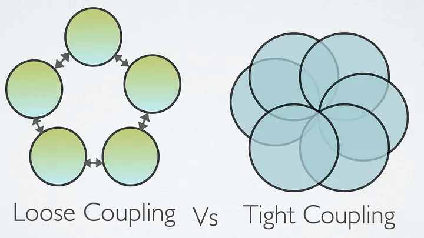

# Впровадження залежностей (Dependency Injection)

## На що звернути увагу

Зверніть увагу на те, що таке залежності та як вони впливають на архітектуру вашого коду. Ви дізнаєтеся про різні способи передачі залежностей та розберетеся, як працюють IoC-контейнери.

## Спробуйте самі

Спробуйте на практиці розібратися, де саме доречно використовувати оператор `new`: переконайтеся, що ви створюєте об’єкти лише в корені композиції, а не всередині бізнес-класів. Дослідіть вбудовані засоби IoC у C# та .NET. Також поекспериментуйте з різними життєвими циклами сервісів, такими як Transient, Scoped та Singleton.

## Пов’язані лабораторні

- [Загальний план, №12, №14](../labs/general/lab-12-library-solid-ioc.md)
- [Індивідуальний план, №15, №17](../labs/individual/lab-15-library-solid-ioc.md)

---

# Dependency injection🪄

**Щільне зв'язування (Tight Coupling)**

Об'єкт із щільним зв'язуванням — це об'єкт, який потребує знань про багато інших об'єктів і зазвичай має високу залежність від їхніх інтерфейсів. Зміна одного об'єкта в додатку із щільним зв'язуванням часто вимагає змін у багатьох інших об'єктах. У малому додатку ви можете легко ідентифікувати зміни, і є менший шанс щось пропустити. Проте у великих додатках ці взаємозалежності не завжди відомі кожному розробнику, або є шанс проігнорувати зміни. Натомість об'єкти зі слабким зв'язуванням менш залежні один від одного.



```csharp
public class LogManager
{
    public void LogToConsole(string message)
    {
        Console.WriteLine($"Logging to console: {message}");
    }

    public void LogToFile(string message)
    {
        Console.WriteLine($"Logging to file: {message}");
    }
}

public class MessageProcessorForTightCoupling
{
    private LogManager logManager; 

    public MessageProcessorForTightCoupling()
    { 
        this.logManager = new LogManager();
    }

    public void ProcessMessage(string message)
    {
        Console.WriteLine($"Processing message: {message}");
        this.logManager.LogToFile($"Message processed: {message}");
    }
 }
 
MessageProcessorForTightCoupling messageProcessor = new MessageProcessorForTightCoupling();
messageProcessor.ProcessMessage("Sample message");
```

**Щоб усунути такі проблеми, слід внести структурні зміни в відносини між класами, і ці відносини слід надавати через абстрактні класи або інтерфейси.**

**Слабке зв'язування**

Слабке зв'язування — це ціль проєктування, яка прагне зменшити взаємозалежність між компонентами системи, щоб знизити ризик того, що зміни в одному компоненті потребуватимуть змін у будь-якому іншому. Слабке зв'язування є набагато загальнішою концепцією, спрямованою на підвищення гнучкості системи, її легшого обслуговування та стабільності всієї платформи.

Впровадження залежностей має на меті відокремити створення об'єктів від їх використання, що призводить до слабкозв'язних програм. Цей шаблон гарантує, що об'єкт або функція, яка хоче використовувати певний сервіс, не повинна знати, як цей сервіс конструювати

Ш[аблон проєктування програмного забезпечення](https://uk.wikipedia.org/wiki/%D0%A8%D0%B0%D0%B1%D0%BB%D0%BE%D0%BD%D0%B8_%D0%BF%D1%80%D0%BE%D1%94%D0%BA%D1%82%D1%83%D0%B2%D0%B0%D0%BD%D0%BD%D1%8F_%D0%BF%D1%80%D0%BE%D0%B3%D1%80%D0%B0%D0%BC%D0%BD%D0%BE%D0%B3%D0%BE_%D0%B7%D0%B0%D0%B1%D0%B5%D0%B7%D0%BF%D0%B5%D1%87%D0%B5%D0%BD%D0%BD%D1%8F), що передбачає надання зовнішньої залежності [програмному компоненту](https://uk.wikipedia.org/wiki/%D0%9A%D0%BE%D0%BC%D0%BF%D0%BE%D0%BD%D0%B5%D0%BD%D1%82%D0%BD%D0%BE-%D0%BE%D1%80%D1%96%D1%94%D0%BD%D1%82%D0%BE%D0%B2%D0%B0%D0%BD%D0%B5_%D0%BF%D1%80%D0%BE%D0%B3%D1%80%D0%B0%D0%BC%D1%83%D0%B2%D0%B0%D0%BD%D0%BD%D1%8F), використовуючи [«інверсію керування»](https://uk.wikipedia.org/wiki/%D0%86%D0%BD%D0%B2%D0%B5%D1%80%D1%81%D1%96%D1%8F_%D0%BA%D0%B5%D1%80%D1%83%D0%B2%D0%B0%D0%BD%D0%BD%D1%8F) ([англ.](https://uk.wikipedia.org/wiki/%D0%90%D0%BD%D0%B3%D0%BB%D1%96%D0%B9%D1%81%D1%8C%D0%BA%D0%B0_%D0%BC%D0%BE%D0%B2%D0%B0) *Inversion of control*, IoC) для розв'язання (отримання) залежностей.

Впровадження — це передача [залежності](https://uk.wikipedia.org/wiki/%D0%97%D0%B2%27%D1%8F%D0%B7%D0%BD%D1%96%D1%81%D1%82%D1%8C_(%D0%BF%D1%80%D0%BE%D0%B3%D1%80%D0%B0%D0%BC%D1%83%D0%B2%D0%B0%D0%BD%D0%BD%D1%8F)) (тобто, сервісу) залежному [об'єкту](https://uk.wikipedia.org/wiki/%D0%9E%D0%B1%27%D1%94%D0%BA%D1%82_(%D0%BF%D1%80%D0%BE%D0%B3%D1%80%D0%B0%D0%BC%D1%83%D0%B2%D0%B0%D0%BD%D0%BD%D1%8F)) (тобто, клієнту). Передавати залежності клієнту замість того, щоб дозволити клієнту створювати сервіс самостійно, є фундаментальною вимогою до цього [шаблону проєктування](https://uk.wikipedia.org/wiki/%D0%A8%D0%B0%D0%B1%D0%BB%D0%BE%D0%BD%D0%B8_%D0%BF%D1%80%D0%BE%D1%94%D0%BA%D1%82%D1%83%D0%B2%D0%B0%D0%BD%D0%BD%D1%8F_%D0%BF%D1%80%D0%BE%D0%B3%D1%80%D0%B0%D0%BC%D0%BD%D0%BE%D0%B3%D0%BE_%D0%B7%D0%B0%D0%B1%D0%B5%D0%B7%D0%BF%D0%B5%D1%87%D0%B5%D0%BD%D0%BD%D1%8F).

```csharp
internal class Program
{
	static void Main(string[] args)
	{
		using IHost host = Host.CreateDefaultBuilder()
							   .ConfigureServices((_, services) =>
							   {
							   	services.AddSingleton<IEmailNotification, EmailNotification>();
							   	services.AddSingleton<NotificationService>();
							   })
							   .Build();

		using var scope = host.Services.CreateScope();

		var services = scope.ServiceProvider;

		var emailSender = services.GetService<IEmailNotification>();

		var notificationSender = services.GetService<NotificationService>();

		notificationSender.PushNotification("dependency injection is not equal dependency inversion");
	}

	public interface IEmailNotification
	{
		public void Notify(string message);
	}

	public class EmailNotification : IEmailNotification
	{
		public EmailNotification()
		{
			Console.WriteLine("EmailNotification created");
		}

		public void Notify(string message)
		{
			Console.WriteLine("Email sent: " + message);
		}
	}

	public class NotificationService
	{
		private readonly IEmailNotification notificationProvider;

		public NotificationService(IEmailNotification customerService)
		{
			notificationProvider = customerService;
		}

		public void PushNotification(string message)
		{
			notificationProvider.Notify(message);
		}
	}

}
```

## Service lifetimes

Lifetime підказує контейнеру Microsoft.Extensions.DependencyInjection, **як довго житиме екземпляр** після `GetService` або інжекції в конструктор.

Три режими:

| Lifetime | Коли створюється | Де один і той самий | Типовий приклад |
|---|---|---|---|
| **Transient** | щоразу, коли просять | ніде — завжди новий | мапер, калькулятор, дрібний helper |
| **Scoped** | один раз на scope | у межах одного scope або HTTP-запиту | `DbContext`, поточний користувач |
| **Singleton** | один раз на застосунок | скрізь, усі scope бачать те саме | конфіг, кеш, фабрика клієнтів |

У ASP.NET Core scope відкривається на кожен HTTP-запит самостійно. У консолі ви створюєте scope вручну:

```csharp
using var scope = host.Services.CreateScope();
var db = scope.ServiceProvider.GetRequiredService<IOrderDb>();
```

### Як побачити різницю

Один клас `Operation` у конструкторі запам’ятовує свій `Guid`. Ми реєструємо його тричі — як Transient, Scoped і Singleton. Далі відкриваємо два scope і робимо по два резолви в кожному.

```csharp
public class Operation : ITransientOp, IScopedOp, ISingletonOp
{
    public Guid Id { get; } = Guid.NewGuid();
}

services.AddTransient<ITransientOp, Operation>();
services.AddScoped<IScopedOp, Operation>();
services.AddSingleton<ISingletonOp, Operation>();
```

Ось що ви побачите:

- два Transient у одному scope — **різні** Guid;
- два Scoped у одному scope — **однакові**;
- Scoped у двох scope — **різні**;
- Singleton у двох scope — **один і той самий**.

Код прикладу: `code/lecture-05-dependency-injection`.

### Коли який брати

**Transient.** Коли немає спільного стану і об’єкт дешевий. Його можна безпечно передавати в Scoped і Singleton, адже він живе недовго. Не кладіть сюди підключення до БД чи великий кеш.

**Scoped.** Коли є один «контекст роботи»: транзакція, unit of work, дані поточного запиту. Не резолвіть Scoped із кореня контейнера без `CreateScope`, інакше отримаєте warning або виняток.

**Singleton.** Коли вам потрібне щось спільне на весь процес. Він має бути thread-safe. Створюється при першому запиті (або одразу, якщо ви реєструєте готовий екземпляр).

### Captive dependency

Довгоживучий сервіс не може тримати короткоживучий у полі: ваш Scoped тоді житиме стільки ж, скільки й Singleton.

```csharp
services.AddScoped<IOrderDb, OrderDb>();
services.AddSingleton<OrderCache>(); // конструктор(IOrderDb) — полон
```

`OrderCache` створиться раз і назавжди залишить собі один `OrderDb`. Ваш наступний HTTP-запит побачить чужий контекст.

Правило: **залежність живе не довше за свого власника.**

- Singleton залежить лише від Singleton;
- Scoped — від Scoped або Singleton;
- Transient — від будь-кого.

[DI в консолі](https://jason.sultana.net.au/dotnet/testing/2022/08/06/dependency-injection-in-console-app.html) · [Service lifetimes (Microsoft)](https://learn.microsoft.com/en-us/dotnet/core/extensions/dependency-injection#service-lifetimes)
