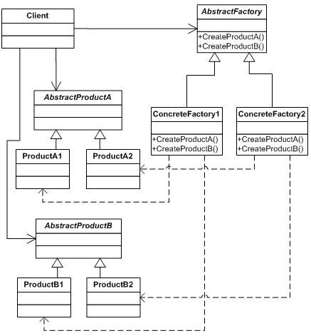
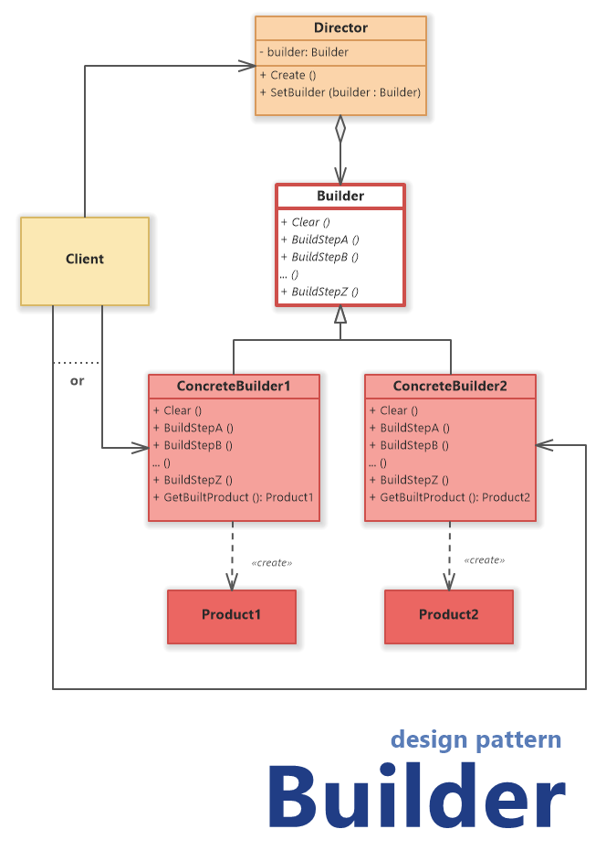

# Класичні патерни GoF: породжувальні

## На що звернути увагу

- Патерн називає типову проблему і спосіб її розв’язати; готовий клас з інтернету копіювати не варто.
- Існує три сім’ї патернів GoF; сьогодні ми розглядаємо породжувальні.
- Проста фабрика, фабричний метод та абстрактна фабрика — це різні речі, які не варто плутати.
- Якщо вам потрібен Одинак у реальному проєкті, використовуйте `AddSingleton` або `Lazy<T>`, а не пишіть власний `Instance`.
- Будівельник та fluent API стануть основою вашої лабораторної роботи зі створення `SqlBuilder`.

## Спробуйте самі

- Напишіть просту фабрику зі `switch` і переконайтеся, чому додавання нового каналу порушує принцип OCP.
- Реалізуйте фабричний метод: створіть базовий `Dialog`, де нащадок сам обирає потрібну кнопку.
- Порівняйте три шляхи для звітів: `switch`, DI і `ReportExporter.Export()`.
- Створіть абстрактну фабрику, щоб гарантувати, що Win- та Mac-компоненти ніколи не змішуються.
- Порівняйте Одинак: напишіть небезпечний `Instance` і перепишіть його через безпечний `Lazy<T>`.
- Побудуйте запит через Будівельник: викличте ланцюжок `Select().OrderBy().Take().Build()`.
- Ознайомтеся з патерном Прототип; різницю між shallow та deep copy ми детально розберемо на лекції 09.

## Пов’язані лабораторні

- [Загальний план, №13](../labs/general/lab-13-sql-builder.md)
- [Індивідуальний план, №16](../labs/individual/lab-16-sql-builder.md)

---

# Патерни проектування 💻

**Патерн проєктування** — це типовий спосіб вирішення певної проблеми, що часто зустрічається під час проєктування архітектури програм.

На відміну від готових функцій чи бібліотек, патерн не можна просто взяти й скопіювати в програму. Патерн являє собою не якийсь конкретний код, а загальний принцип вирішення певної проблеми, який майже завжди треба підлаштовувати для потреб тієї чи іншої програми.

Патерни часто плутають з алгоритмами, бо обидва описують типові рішення. Різниця проста: алгоритм каже точно, які кроки зробити. Патерн лише називає проблему і підхід. У двох проєктах код буде різний, ідея — та сама. Готовий клас «з інтернету» сюди не вставляють: підлаштовуєте під свою задачу.

Описи патернів зазвичай дуже формальні й найчастіше складаються з таких пунктів:

- проблема, яку вирішує патерн;
- мотивація щодо вирішення проблеми способом, який пропонує патерн;
- структура класів, складових рішення;
- приклад однією з мов програмування;
- особливості реалізації в різних контекстах;
- зв’язки з іншими патернами.

Концепцію патернів вперше описав Крістофер Александер «**Мова шаблонів. Міста. Будівлі. Будівництво**»

У програмуванні описана так званою «Бандою чотирьох» (GoF).

- **Породжувальні патерни** піклуються про гнучке створення об’єктів без внесення в програму зайвих залежностей.
- **Структурні патерни** показують різні способи побудови зв’язків між об’єктами.
- **Поведінкові патерни** піклуються про ефективну комунікацію між об’єктами.

## Абстрактна фабрика



[https://www.dofactory.com/img/diagrams/net/abstract.png](https://www.dofactory.com/img/diagrams/net/abstract.png)

### Абстрактна фабрика — це породжувальний шаблон проєктування, який вирішує проблему створення цілих сімей продуктів без вказівки їхніх конкретних класів.

Абстрактна фабрика визначає інтерфейс для створення усіх різних продуктів, але залишає фактичне створення продуктів конкретним фабричним класам. Кожен тип фабрики відповідає певному різновиду продуктів.

Клієнтський код викликає методи створення фабричного об'єкта замість безпосереднього створення продуктів за допомогою конструктора (оператор new). Оскільки фабрика відповідає одному варіанту продукту, усі її продукти будуть сумісними.

Клієнтський код працює з фабриками та продуктами тільки через їхні абстрактні інтерфейси. Це дозволяє клієнтському коду працювати з будь-якими варіантами продуктів, створеними фабричним об'єктом. Ви просто створюєте новий конкретний фабричний клас і передаєте його клієнтському коду.

```csharp
// абстрактний продукт A
public interface IBluetoothCommFactory
{
}

// абстрактний продукт B
public interface IWifiCommFactory
{
}

// абстрактна фабрика 
public interface ICommunicationBaseFactory
{
	IBluetoothCommFactory InitializeBluetoothCommunication();

	IWifiCommFactory InitializeWiFiCommnucation();
}

// конкретна (визначена, уточнена), але базова реалізація фабрики A
public class BluetoothGenericCommunication : IBluetoothCommFactory
{
	public BluetoothGenericCommunication()
	{
		// логіка передачі даних через bluetooth 
		Console.WriteLine("Bluetooth Communication was initialized");
	}
}

// конкретна (визначена, уточнена), але базова реалізація фабрики B
public class WiFiGenericCommunication : IWifiCommFactory
{
	public WiFiGenericCommunication()
	{
		// логіка передачі даних через wifi
		Console.WriteLine("WIFI (generic) Communication was initialized");
	}
}

// описуємо уточнений продукт який пі
public class ArduinoChipProduct : ICommunicationBaseFactory
{
	public IBluetoothCommFactory InitializeBluetoothCommunication()
	{
		return new BluetoothGenericCommunication();
	}

	public IWifiCommFactory InitializeWiFiCommnucation()
	{
		return new WiFiGenericCommunication();
	}
}

// --------------------------------------------------------

public class BluetoothLowEnergyCommunication : IBluetoothCommFactory
{
	public BluetoothLowEnergyCommunication()
	{
		// Implement some init logic here...
		Console.WriteLine("Bluetooth Low Energy Communication was initialized");
	}
}

public class WiFiLowBandCommunication : IWifiCommFactory
{
	public WiFiLowBandCommunication()
	{
		// Implement some init logic here...
		Console.WriteLine("WIFI Low Band Communication was initialized");
	}
}

public class WifiHighBandCommunication : IWifiCommFactory
{
	public WifiHighBandCommunication()
	{
		// Implement some init logic here...
		Console.WriteLine("WIFI High Band Communication was initialized");
	}
}	

// описуємо ще детальніший продукт
public class Esp32Product : ICommunicationBaseFactory
{
	public enum BluetoothType
	{
		CLASSIC_TYPE,
		BLE_TYPE
	}

	public enum WiFiType
	{
		LOW_BAND,
		HIGH_BAND
	}

	private BluetoothType bluetoothType;
	private WiFiType wifiType;

	public Esp32Product(BluetoothType bluetoothType, WiFiType wifiType)
	{
		this.bluetoothType = bluetoothType;
		this.wifiType = wifiType;
	}

	public IBluetoothCommFactory InitializeBluetoothCommunication()
	{
		return InitializeBluetooth(bluetoothType);
	}

	public IWifiCommFactory InitializeWiFiCommnucation()
	{
		return InitializeWifi(wifiType);
	}

	static IBluetoothCommFactory InitializeBluetooth(BluetoothType bluetoothType)
	{
		return bluetoothType switch
		{
			BluetoothType.CLASSIC_TYPE => new BluetoothGenericCommunication(),
			BluetoothType.BLE_TYPE => new BluetoothLowEnergyCommunication(),
			_ => throw new NotSupportedException("Unknown Bluetooth type"),
		};
	}

	private static IWifiCommFactory InitializeWifi(WiFiType wifiType)
	{
		return wifiType switch
		{
			WiFiType.LOW_BAND => new WiFiLowBandCommunication(),
			WiFiType.HIGH_BAND => new WifiHighBandCommunication(),
			_ => throw new NotSupportedException("Unknown WIFI type"),
		};
	}
}

internal class Program
{
	static void Main(string[] args)
	{
		ICommunicationBaseFactory baseFactory = new ArduinoChipProduct();
		baseFactory.InitializeBluetoothCommunication();
		baseFactory.InitializeWiFiCommnucation();

		baseFactory = new Esp32Product(BluetoothType.BLE_TYPE, WiFiType.HIGH_BAND);
		baseFactory.InitializeBluetoothCommunication();
		baseFactory.InitializeWiFiCommnucation();

	}
}

```

Гарний приклад абстрактної фабрики:

 1. [https://learn.microsoft.com/en-us/dotnet/framework/data/adonet/data-providers](https://learn.microsoft.com/en-us/dotnet/framework/data/adonet/data-providers) DbProviderFactory

1. [https://learn.microsoft.com/en-us/dotnet/api/microsoft.aspnetcore.mvc.controllers.icontrollerfactory?view=aspnetcore-7.0](https://learn.microsoft.com/en-us/dotnet/api/microsoft.aspnetcore.mvc.controllers.icontrollerfactory?view=aspnetcore-7.0)
2. LoggerFactory

### Одинак

Шаблон «Одинак» є одним із найвідоміших шаблонів у програмній інженерії. По суті, одинак — це клас, який дозволяє створити лише один екземпляр себе і зазвичай забезпечує простий доступ до цього екземпляра. Зазвичай одинаки не дозволяють вказувати параметри при створенні екземпляра, оскільки інакше другий запит на екземпляр, але з іншим параметром, міг би стати проблематичним! (Якщо має бути доступ до того ж екземпляра за всіх запитів з тим самим параметром, більш доцільним є використання шаблону фабрики.) Ця стаття стосується лише ситуації, коли параметри не потрібні. Зазвичай вимогою до одинаків є їх ліниве створення, тобто екземпляр не створюється, доки він уперше не знадобиться.

Проста версія одинака який не можна використовувати!

```csharp
// оголовшуємо запечатаний клас, для того щоб не можна було унаслідуватися
public sealed class Singleton
{
	private static Singleton instance = null;

	// приватний конструктор, для того щоб клієнтський код не створив екземпляр обєкта
	private Singleton()
	{
	}

	// статичний метод який контролює створення одинака
	public static Singleton Instance
	{
		get
		{
			// при першому виклику одинака не буде і ми його створимо
			if (instance == null)
			{
				instance = new Singleton();
			}

			// всі наступні виклики будуть віддавати існуючий екземпляр
			return instance;
		}
	}
}
```

**Будівельник**

Будівельник — це патерн проєктування, який дозволяє вам будувати складні об'єкти крок за кроком. Цей патерн відокремлює об'єкт від його представлення, щоб один і той самий процес конструювання міг створювати різні представлення.

Будівельник — це зручний інструмент, коли у вас є набір частин для складного об'єкта і потрібно побудувати їх усі разом. Із цим патерном ви можете ініціалізувати кожну частину складного об'єкта поетапно, а потім зібрати їх у повний об'єкт.



Цей патерн має наступні складові:

**Director** - це клас, який визначає, в яких кроках слід будувати складний клас. У цьому прикладі назва складного об'єкта - Product. Він не будує клас Product безпосередньо, а замість цього викликає інтерфейс/абстрактний клас Builder для створення частин.

**Builder** - інтерфейс/абстрактний Builder визначає всі необхідні методи для побудови класу Product. Ці методи є загальними для всіх реалізацій будівельника. Директор викликає метод Build, щоб отримати результат конструювання.

**ConcreteBuilder** - реалізує інтерфейс/абстрактний клас Builder. Він бере клас Product і поетапно будує його.

**Product** -  це складний клас, який нам потрібно побудувати.

**+**

- Дозволяє створювати продукти покроково.
- Дозволяє використовувати один і той самий код для створення різноманітних продуктів.
- Ізолює складний код конструювання продукту від його головної бізнес-логіки.

**-**

- Ускладнює код програми за рахунок додаткових класів.
- Клієнт буде прив’язаний до конкретних класів будівельників, тому що в інтерфейсі будівельника може не бути методу отримання результату.

Розглянемо класичний приклад будівельника на основі конструювання піцци:

```csharp

namespace Pizza
{
	public class Pizza
	{
		private string pizzaName;
		private readonly Dictionary<string, string> ingredients =
		  new Dictionary<string, string>();

		public Pizza(string pizzaName)
		{
			this.pizzaName = pizzaName;
		}

		// індексатор
		public string this[string key]
		{
			get
			{
				return ingredients[key];
			}
			set
			{
				ingredients[key] = value;
			}
		}

		public void Display()
		{
			Console.WriteLine("Pizza {0} consist of: ", pizzaName);
			foreach (var ingridient in ingredients)
			{
				Console.WriteLine(ingridient);
			}
		}
	}

	public abstract class PizzaBuilder
	{
		protected Pizza pizza;

		// Будуємо екземпляр
		public Pizza Build()
		{
			return pizza;
		}

		// додати тісто
		public abstract void AddDough();
		public abstract void AddSauce();
		public abstract void AddMeats();
		public abstract void AddCheeses();
		public abstract void AddVeggies();
		public abstract void AddExtras();
	}

	public class MaestroPizzaAssemblyLine
	{
		// процес побудови складного обєкта
		public void Assemble(PizzaBuilder pizzaBuilder)
		{
			pizzaBuilder.AddDough();
			pizzaBuilder.AddSauce();
			pizzaBuilder.AddCheeses();
			pizzaBuilder.AddMeats();
			pizzaBuilder.AddVeggies();
			pizzaBuilder.AddExtras();
		}
	} 	

	// конкретний будівельник
	class MeatFeastHot : PizzaBuilder
	{
		public MeatFeastHot()
		{
			pizza = new Pizza("Meat Feast Hot");
		}

		public override void AddDough()
		=> pizza["dough"] = "Wheat pizza dough";

		public override void AddSauce()
		=> pizza["sauce"] = "Tomato base";

		public override void AddMeats()
		=> pizza["meats"] = "Pepperoni, Ham, Beef, Chicken";

		public override void AddCheeses()
		=> pizza["cheeses"] = "Signature triple cheese blend, mozzarella";

		public override void AddVeggies()
		=> pizza["veggies"] = "";

		public override void AddExtras()
		=> pizza["extras"] = "jalapenos";
	}

	// конкретний будівельник
	class HotNSpicyVeg : PizzaBuilder
	{
		public HotNSpicyVeg()
		{
			pizza = new Pizza("Hot 'N' Spicy Veg");
		}

		public override void AddDough() => 
			pizza["dough"] = "12-grain pizza dough";

		public override void AddSauce() =>
			pizza["sauce"] = "Tomato base";

		public override void AddMeats() => 
			pizza["meats"] = "";

		public override void AddCheeses() =>
			pizza["cheeses"] = "Signature triple cheese blend, mozzarella";

		public override void AddVeggies() => 
			pizza["veggies"] = "Mushrooms, Peppers, Red Onions";

		public override void AddExtras() => 
			pizza["extras"] = "Jalapenos";
	}

	internal class Program
	{
		static void Main(string[] args)
		{
			PizzaBuilder builder;

			// створємо директора \ деригента \ того хто знає послідовність складання
			MaestroPizzaAssemblyLine shop = new MaestroPizzaAssemblyLine();

			// конструююємо піцу
			builder = new MeatFeastHot();

			shop.Assemble(builder);
			builder.Build().Display();

			builder = new HotNSpicyVeg();
			shop.Assemble(builder);
			builder.Build().Display();

		}
	}
}
```

І реальний приклад використання будівельника:

```csharp
public class HttpRetryBuilder
{
	private int maxRetries = 1;
	private TimeSpan retryDelay = TimeSpan.Zero;
	private Func<Task<HttpResponseMessage>> requestFunc;

	private HttpRetryBuilder()
	{
	}

	public static HttpRetryBuilder Create()
	{
		return new HttpRetryBuilder();
	}

	public HttpRetryBuilder WithMaxRetries(int retries)
	{
		maxRetries = retries;
		return this;
	}

	public HttpRetryBuilder WithRetryDelay(TimeSpan delay)
	{
		retryDelay = delay;
		return this;
	}

	public HttpRetryBuilder WithRequest(Func<Task<HttpResponseMessage>> requestFunc)
	{
		this.requestFunc = requestFunc;
		return this;
	}

	public async Task<HttpResponseMessage> ExecuteAsync()
	{
		int retries = 0;
		while (retries <= maxRetries)
		{
			try
			{
				//HttpResponseMessage response = await requestFunc();
				HttpResponseMessage response = await requestFunc.Invoke();
				if (response.IsSuccessStatusCode)
				{
					return response;
				}
			}
			catch (Exception ex)
			{
				Console.WriteLine($"{retries + 1} failed with exception: {ex.Message}");
			}

			retries++;
			if (retries <= maxRetries)
			{
				Console.WriteLine($"Retrying in {retryDelay.TotalSeconds} seconds");
				await Task.Delay(retryDelay);
			}
		}

		throw new Exception("Max retries reached without success.");
	}
}

class Program
{
	static async Task Main()
	{
		// Build and execute the HTTP request with retry
		HttpResponseMessage response = await HttpRetryBuilder
			.Create()
			.WithMaxRetries(3)
			.WithRetryDelay(TimeSpan.FromSeconds(2))
			.WithRequest(MakeHttpRequest)
			.ExecuteAsync();

	}

	static async Task<HttpResponseMessage> MakeHttpRequest()
	{
		using (HttpClient httpClient = new HttpClient())
		{
			return await httpClient.GetAsync("https://www.mynicedom.com");
		}
	}
}
```

Приклад будівельника реалізованого в бібліотеці Polly:

```csharp
//https://github.com/App-vNext/Polly
internal class Program
{
	static async Task Main(string[] args)
	{
		//Create an instance of builder that exposes various extensions for adding resilience strategies

	   ResiliencePipeline pipeline = new ResiliencePipelineBuilder()
		   .AddRetry(new RetryStrategyOptions()) // Add retry using the default options
		   .AddTimeout(TimeSpan.FromSeconds(10)) // Add 10 seconds timeout
		   .Build(); // Builds the resilience pipeline

		CancellationTokenSource source = new CancellationTokenSource();
		CancellationToken cancellationToken = source.Token;

		// Execute the pipeline asynchronously
		await pipeline.ExecuteAsync(static async token =>
		{

			using (HttpClient httpClient = new HttpClient())
			{
				return await httpClient.GetAsync("https://www.mynicedom.com");
			}

		}, cancellationToken);		
	}
}
```

## Фабричний метод

**Фабричний метод** виносить виклик `new` у перевизначуваний метод підкласу. Завдяки цьому ваш клієнтський код залежатиме від абстракції продукту, а не від його конкретного класу. Практичний приклад на C# зі створенням типу за іменем (через `Activator.CreateInstance`) ви побачите в лекції про [вбудовані шаблони](09-builtin-csharp-patterns.md).

Будь ласка, не плутайте його з **простою фабрикою**, де ви маєте лише один метод зі `switch` і жодного наслідування. Також відрізняйте його від **абстрактної фабрики**, де одна фабрика видає цілу сім’ю сумісних продуктів (наприклад, кнопку та прапорець однієї теми).

```csharp
abstract class Dialog
{
	public abstract IButton CreateButton();

	public void Render() => CreateButton().Draw();
}

class WinDialog : Dialog
{
	public override IButton CreateButton() => new WinButton();
}
```

Фабричний метод варто брати лише тоді, коли базовий клас має сценарій, а `Create()` — маленький гачок у ньому. Якщо клас-фабрика вміє лише `Create()` і більше нічого — ієрархію ви роздули даремно.

**Коли вистачить простої фабрики.** Логіка створення тривіальна: треба лише обрати клас. Один `switch` дешевший за десяток порожніх фабрик. OCP ви порушите, коли з’явиться новий формат, але підтримувати один метод легше.

```csharp
static class ReportFactory
{
	public static IReport Create(string type) => type switch
	{
		"pdf" => new PdfReport(),
		"excel" => new ExcelReport(),
		"html" => new HtmlReport(),
		_ => throw new ArgumentOutOfRangeException(nameof(type))
	};
}
```

**Або взагалі DI.** Якщо мета — щоб клієнт залежав від `IReport`, а не від `new PdfReport()`, контейнер уже є універсальною фабрикою. Це лекція 05. Окремий `ReportFactory` тоді не пишете.

```csharp
services.AddTransient<IReport, PdfReport>();
services.AddTransient<ReportMailer>();

class ReportMailer
{
	private readonly IReport _report;
	public ReportMailer(IReport report) => _report = report;
}
```

**Коли фабричний метод справді потрібен.** Базовий клас веде кроки: створити, зібрати, зберегти. Нащадок лише підставляє продукт. Це часто поєднують із шаблонним методом.

```csharp
abstract class ReportExporter
{
	public string Export()
	{
		var report = Create();
		report.Build();
		return report.Save();
	}

	protected abstract IReport Create();
}

class PdfExporter : ReportExporter
{
	protected override IReport Create() => new PdfReport();
}
```

Код порівняння: `code/lecture-06-gof-creational` — `WhenFactoryMethodDemo`.

## Прототип

Патерн **Прототип** дозволяє вам скопіювати вже зібраний об’єкт замість того, щоб збирати його з нуля. У мові C# для цього існують інтерфейс `ICloneable` та метод `MemberwiseClone`.

Сьогодні вам достатньо знати лише назву цього патерну й розуміти, навіщо він існує. Різницю між поверхневою та глибокою копією ми детально розберемо в лекції про [вбудовані шаблони](09-builtin-csharp-patterns.md).

## Коли який породжувальний патерн обирати

- Треба лише обрати тип — проста фабрика або DI. Фабричний метод беріть, коли базовий клас ще й веде сценарій (`Export`, `Render`).
- Якщо ви маєте кілька продуктів, які обов’язково мають підходити одне до одного, вам потрібна абстрактна фабрика.
- Якщо об’єкт має багато опцій і ви збираєте його покроково, використовуйте будівельник.
- Якщо вам справді потрібен лише один екземпляр на весь процес, реєструйте Singleton у контейнері або використовуйте `Lazy<T>`.
- Якщо вам потрібна копія вже налаштованого об’єкта, зверніть увагу на прототип (про нього поговоримо на лекції 09).

Ви можете знайти код до цих слайдів у теці `code/lecture-06-gof-creational`.
