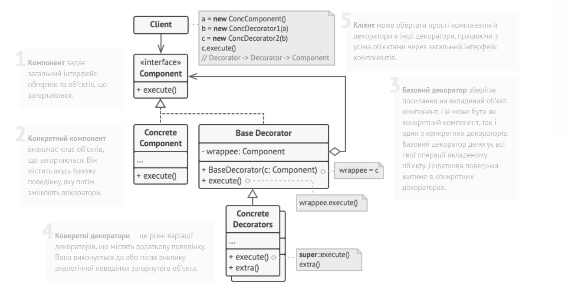
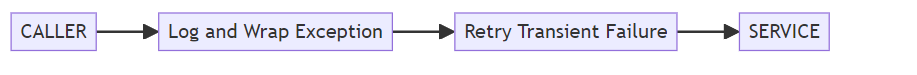
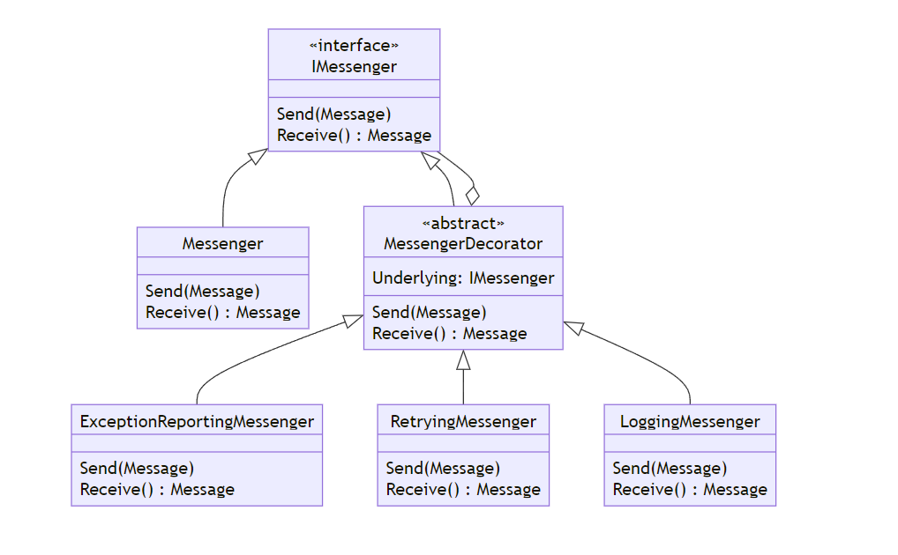
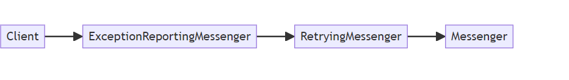
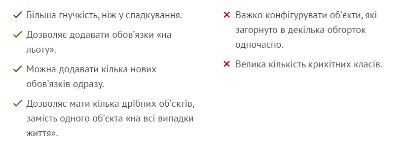
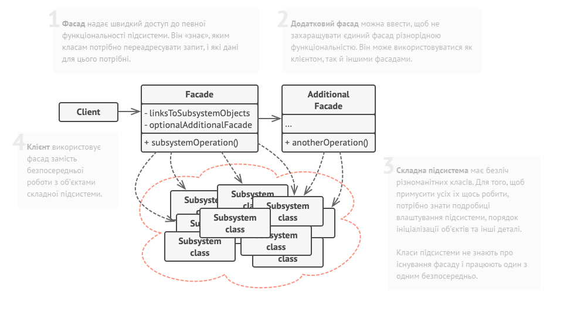
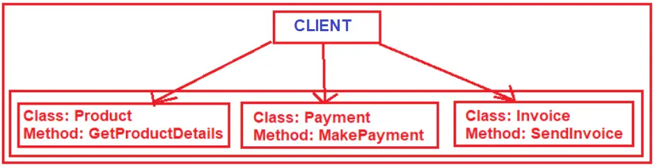

# Класичні патерни GoF: структурні

## На що звернути увагу

- Структурні патерни

## Спробуйте самі

- Адаптер
- Фасад
- Компонувальник
- Декоратор

## Пов’язані лабораторні

- Окремої лабораторної на структурні патерни немає; далі в курсі — поведінкові патерни та медіатор.

---

# Декоратор 💽

Шаблон проєктування «Декоратор» дозволяє вам розширювати функціонал компонента без зміни його коду. Розгляньмо основні методи реалізації шаблону декоратора в сучасному .NET, дотримуючись принципу єдиної відповідальності (SRP) та уникаючи надлишкового коду.



Шаблон "Декоратор" корисний, коли потрібно додати поведінку до існуючого компонента, але ви або не можете, або не хочете змінювати вихідний код. Це зазвичай робиться для дотримання принципу єдиної відповідальності (SRP), щоб код залишався чистим, зрозумілим і легким у супроводі.

Деякі реальні приклади використання шаблону "Декоратор" включають:

- **Політики виконання**, такі як обробка винятків, повторні спроби або кешування, що допомагають покращити продуктивність і надійність ваших додатків.
- **Спостережуваність**, наприклад, шляхом додавання журналювання до всіх викликів зовнішнього компонента.
- **Інтерфейс користувача**, як-от додавання смуги прокрутки до великого текстового поля. Інший приклад — концепція Adorner у WPF.
- **Потоки**, із такими функціями, як буферизація, шифрування або стиснення.

Декоратор — це, по суті, обгортка, яка реалізує той самий контракт, що й сутність, яку вона обгортає. Ми навмисно використовуємо термін "контракт" у широкому сенсі. Як буде показано нижче, це може означати два варіанти: інтерфейс C#, якщо ми реалізуємо декоратор для типу, або сигнатуру методу, якщо ми реалізуємо декоратор для методу. У будь-якому випадку викликаючій стороні не потрібно знати, що вона працює з декоратором, а не з остаточною реалізацією. Шаблон є рекурсивним: ми можемо додати декоратор до іншого декоратора, створюючи ланцюжок відповідальності.

Наприклад, замість прямого виклику ненадійного сервісу, ми можемо захотіти зробити кілька повторних спроб у разі тимчасового збою, а потім призначити унікальний ідентифікатор кожному винятку, записати його в журнал і обгорнути виняток. Ми можемо представити цей ланцюжок так:



### Класичний шаблон декоратора для типів

Класичний шаблон декоратора для типів — це суто об'єктно-орієнтований варіант шаблону декоратора, який ґрунтується на інтерфейсах типів.

Щоб проілюструвати цю концепцію, уявімо, що ми розробляємо простий додаток для обміну повідомленнями. Нам потрібен компонент, який керує надсиланням і отриманням повідомлень. Цей компонент реалізує інтерфейс **IMessenger** і міститься в сторонній бібліотеці.

```csharp
public interface IMessenger
{
	void Send(Message message);

	public Message Receive();
}

 private int _receiveCount;
    private int _sendCount;

    public void Send( Message message )
    {
        Console.WriteLine( "Sending message..." );

        // Simulate unreliable message sending
        if ( ++this._sendCount % 3 == 0 )
        {
            Console.WriteLine( "Message sent successfully." );
        }
        else
        {
            throw new IOException( "Failed to send message." );
        }
    }

    public Message Receive()
    {
        Console.WriteLine( "Receiving message..." );

        // Simulate unreliable message receiving
        if ( ++this._receiveCount % 3 == 0 )
        {
            Console.WriteLine( "Message received successfully." );

            return new Message( "Hi!" );
        }

        throw new IOException( "Failed to receive message." );
    }
}

public class Message
{
	public string Data { get; private set; }

	public Message(string data)
	{
		Data = data;
	}
}

public class Client(IMessenger messenger)
{
	public void Greet()
	{
		messenger.Send(new Message("Hello, world"));
		Console.WriteLine("--> " + messenger.Receive().Data);
	}
}

internal class Program
{

	static void Main(string[] args)
	{
		var messenger = new Messenger();
		var client = new Client(messenger);
		client.Greet();
	}
}
```

У вашому середовищі розробки все працює чудово. Однак, як тільки ви переносите додаток у продакшн, виявляється, що служба обміну повідомленнями є ненадійною і час від часу спричиняє збій програми. Оскільки у вас немає доступу до вихідного коду реалізації **IMessenger**, ви не можете просто додати необхідну логіку в кожен метод.

### Як шаблон "Декоратор" допомагає вирішити цю проблему?

Шаблон «Декоратор» дозволяє вам обгорнути існуючу реалізацію **IMessenger**, додаючи до неї додаткову поведінку, не змінюючи вихідний код. Ви можете створити ланцюжок декораторів, де кожен додає певну функціональність, наприклад:

- **Обробка помилок**, щоб уникнути збоїв програми.
- **Повторні спроби**, щоб спробувати виконати операцію знову у разі тимчасових проблем.

Щоб зробити це зручнішим, введімо абстрактний клас **MessengerDecorator**, який зберігає посилання на обгорнутий об’єкт **IMessenger**. Це спрощує реалізацію окремих декораторів, зосереджених на конкретних аспектах.



### Діаграма класів

На діаграмі класів це виглядає так:

1. **IMessenger** — інтерфейс, який визначає методи для надсилання та отримання повідомлень.
2. **MessengerImplementation** — стороння реалізація **IMessenger**.
3. **MessengerDecorator** — базовий клас декораторів, який реалізує **IMessenger** і зберігає посилання на обгорнутий об’єкт.
4. **RetryDecorator** — реалізація декоратора для повторних спроб.
5. **ErrorHandlingDecorator** — реалізація декоратора для обробки помилок.

Такий підхід забезпечує гнучкість і дозволяє створювати надійну архітектуру, не змінюючи сторонній код.

```csharp
	public interface IMessenger
	{
		void Send(Message message);

		public Message Receive();
	}

	public class Messenger : IMessenger
	{
		private int _receiveCount;
		private int _sendCount;

		public void Send(Message message)
		{
			Console.WriteLine("Sending message...");

			// Simulate unreliable message sending
			if (++this._sendCount % 3 == 0)
			{
				Console.WriteLine("Message sent successfully.");
			}
			else
			{
				throw new IOException("Failed to send message.");
			}
		}

		public Message Receive()
		{
			Console.WriteLine("Receiving message...");

			// Simulate unreliable message receiving
			if (++this._receiveCount % 3 == 0)
			{
				Console.WriteLine("Message received successfully.");

				return new Message("Hi!");
			}

			throw new IOException("Failed to receive message.");
		}
	}

	public class Message
	{
		public string Data { get; private set; }

		public Message(string data)
		{
			Data = data;
		}
	}

	public class Client(IMessenger messenger)
	{
		public void Greet()
		{
			messenger.Send(new Message("Hello, world"));
			Console.WriteLine("--> " + messenger.Receive().Data);
		}
	}

	public interface IExceptionReportingService
	{
		void ReportException(string v, Exception e);
	}

	public class ExceptionReportingService : IExceptionReportingService
	{
		public void ReportException(string v, Exception e)
		{
			// Simulate reporting exception
			Console.WriteLine($"{v}: {e.Message}");
		}
	}
	public abstract class MessengerDecorator : IMessenger
	{
		protected MessengerDecorator(IMessenger underlying)
		{
			this.Underlying = underlying;
		}

		protected IMessenger Underlying { get; }

		public abstract void Send(Message message);

		public abstract Message Receive();
	}

	public class ExceptionReportingMessenger : MessengerDecorator
	{
		private readonly IExceptionReportingService _reportingService;

		public ExceptionReportingMessenger(
			IMessenger underlying,
			IExceptionReportingService reportingService) :
			base(underlying)
		{
			this._reportingService = reportingService;
		}

		public override void Send(Message message)
		{
			try
			{
				this.Underlying.Send(message);
			}
			catch (Exception e)
			{
				this._reportingService.ReportException("Failed to send message", e);

				throw;
			}
		}

		public override Message Receive()
		{
			try
			{
				return this.Underlying.Receive();
			}
			catch (Exception e)
			{
				this._reportingService.ReportException("Failed to receive message", e);

				throw;
			}
		}

	}

	public class RetryingMessenger : MessengerDecorator
	{
		private readonly int _retryAttempts;
		private readonly int _retryDelay;

		public RetryingMessenger(
			IMessenger underlying,
			int retryAttempts = 3,
			int retryDelay = 1000) : base(underlying)
		{
			this._retryAttempts = retryAttempts;
			this._retryDelay = retryDelay;
		}

		public override void Send(Message message)
		{
			for (var i = 0; ; i++)
			{
				try
				{
					this.Underlying.Send(message);

					return;
				}
				catch (Exception) when (i < this._retryAttempts)
				{
					var delay = this._retryDelay * Math.Pow(2, i);

					Console.WriteLine(
						$"Failed to receive message. Retrying in {delay / 1000} seconds... ({i + 1}/{this._retryAttempts})");

					Thread.Sleep((int)delay);
				}
			}
		}

		public override Message Receive()
		{
			for (var i = 0; ; i++)
			{
				try
				{
					return this.Underlying.Receive();
				}
				catch (Exception) when (i < this._retryAttempts)
				{
					var delay = this._retryDelay * Math.Pow(2, i);

					Console.WriteLine(
						$"Failed to receive message. Retrying in {delay / 1000} seconds... ({i + 1}/{this._retryAttempts})");

					Thread.Sleep((int)delay);
				}
			}
		}
	}

	internal class Program
	{

		static void Main(string[] args)
		{
			var originalMessenger = new Messenger();

			var retryingMessenger = new ExceptionReportingMessenger(
				new RetryingMessenger(originalMessenger),
				new ExceptionReportingService());

			var clientUsingDecorator = new Client(retryingMessenger);
			clientUsingDecorator.Greet();
		}
	}
```

**RetryingMessenger** є дуже схожим на інші декоратори.

Тепер, замість того щоб передавати оригінальний компонент **Messenger** у клас **Client**, ми спочатку обгортаємо **Messenger** у **RetryingMessenger**, а потім у **ExceptionReportingMessenger**. В результаті саме об'єкт **ExceptionReportingMessenger** передається до **Client**.

### Як це працює:

1. **Оригінальний компонент**:
    - **Messenger**: реалізує базову функціональність надсилання та отримання повідомлень.
2. **Перший рівень обгортки**:
    - **RetryingMessenger**: додає логіку повторних спроб для усунення тимчасових збоїв у сервісі.
3. **Другий рівень обгортки**:
    - **ExceptionReportingMessenger**: обробляє винятки, призначаючи їм унікальні ідентифікатори та записуючи їх у журнал.
4. **Передача у клієнт**:
    - Остаточно, **ExceptionReportingMessenger**, який включає всі рівні поведінки, передається до класу **Client**, який не знає, що працює із ланцюгом декораторів, а не з оригінальним компонентом.

### Переваги такого підходу:

- **Гнучкість**: Легко змінювати чи додавати нову поведінку, просто створюючи нові декоратори.
- **Прозорість для клієнта**: Клієнт взаємодіє через один інтерфейс **IMessenger**, незалежно від кількості декораторів.
- **Відокремлення відповідальностей**: Кожен декоратор відповідає лише за свою частину логіки, що сприяє дотриманню принципу єдиної відповідальності (SRP).

Цей підхід забезпечує масштабованість та зручність у підтримці коду, особливо в умовах складних вимог.



### 



[https://blog.postsharp.net/decorator-pattern](https://blog.postsharp.net/decorator-pattern)

---

Фасад



Що таке шаблон проектування Facade у C#?

Згідно з визначенням «Банди чотирьох» (GoF), шаблон проєктування **Facade** стверджує, що потрібно надати уніфікований інтерфейс до набору інтерфейсів у підсистемі. Шаблон Facade визначає інтерфейс вищого рівня, який спрощує використання підсистеми.

Шаблон проєктування **Facade** належить до структурних шаблонів і забезпечує спрощений інтерфейс до складної системи класів, бібліотек або фреймворків. Основна мета цього шаблону — представити клієнтам зрозумілий, спрощений і мінімізований інтерфейс, делегуючи всі складні операції відповідним класам у системі. Клас Facade (зазвичай обгортка) знаходиться на вершині групи підсистем і забезпечує їх взаємодію уніфікованим способом.

Як випливає з назви, **Facade** означає "фасад будівлі". Уявімо, що ви збудували будівлю. Люди, які проходять повз, бачать лише стіни та скло будівлі. Вони не знають нічого про електропроводку, труби, інтер’єри та інші складні елементи всередині. Тобто **Facade** приховує всі складнощі будівлі й показує дружній "фасад" для перехожих.

### Розуміння шаблону Facade у C# на прикладі реального світу:

1. **Визначення складних підсистем**: Спочатку визначте складні частини вашої системи, які потребують спрощення. Це можуть бути складні бібліотеки або системи з безліччю взаємодіючих класів.
2. **Створення класу Facade**: Розробіть клас Facade, який надає простий інтерфейс для роботи зі складними підсистемами.
3. **Делегування запитів до підсистем**: Facade повинен перенаправляти запити клієнта до відповідних об’єктів у підсистемі. Він має обробляти всі тонкощі та залежності підсистем.
4. **Взаємодія клієнтського коду**: Клієнт взаємодіє із системою через Facade, що спрощує використання складних підсистем.



```csharp
using System;
namespace FacadeDesignPattern
{
    // The Facade class provides a simple interface to the complex logic of one
    // or several subsystems. The Facade delegates the client requests to the
    // appropriate objects within the subsystem. 
    public class Order
    {
        public void PlaceOrder()
        {
            Console.WriteLine("Place Order Started");
            //Get the Product Details
            Product product = new Product();
            product.GetProductDetails();
            //Make the Payment
            Payment payment = new Payment();
            payment.MakePayment();
            //Send the Invoice
            Invoice invoice = new Invoice();
            invoice.Sendinvoice();
            Console.WriteLine("Order Placed Successfully");
        }
    }
}
```

## Адаптер і компонувальник

Окрім Decorator і Facade, до структурних патернів курсу входять **Adapter** і **Composite**.

- **Adapter** — обгортка, яка приводить чужий інтерфейс до потрібного контракту (наприклад, старий логер або стороннє API під `ILogger`).
- **Composite** — дерево однотипних вузлів (`IGraphic`: `Circle` і `GroupOfGraphics`), де клієнт працює з листком і групою однаково.

