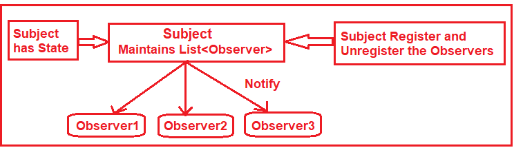
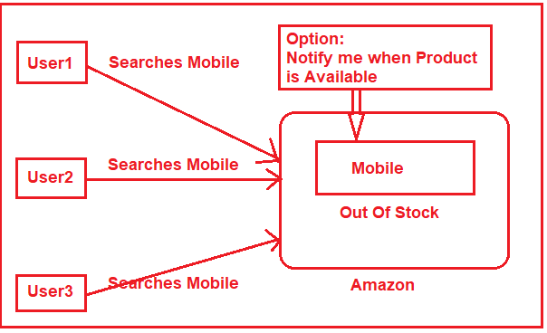
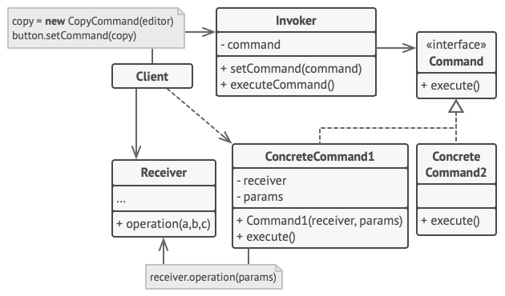
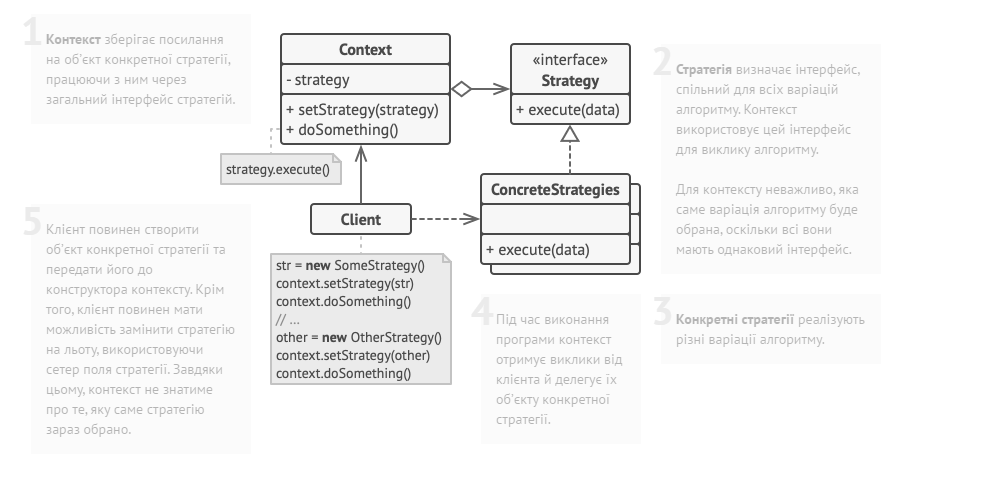
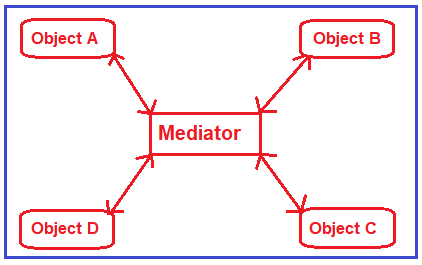
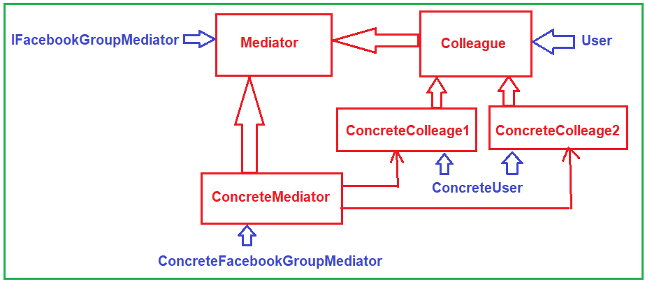

# Класичні патерни GoF: поведінкові

## На що звернути увагу

- Поведінкові патерни

## Спробуйте самі

- Ітератор
- Команда
- Спостерігач
- Стратегія

## Пов’язані лабораторні

- [Загальний план, №14](../labs/general/lab-14-mediator.md)

---

# Оглядач \ Observer⚙️

Шаблон проєктування «Спостерігач» визначає відношення один-до-багатьох між об'єктами, так що коли змінюється стан одного об'єкта, всі його залежні об'єкти автоматично отримують повідомлення та оновлюються.

Цей шаблон проєктування широко використовується для реалізації розподілених систем обробки подій, де об'єкт повинен сповіщати інші об'єкти про зміни свого стану, не знаючи, хто саме ці об'єкти. У шаблоні «Спостерігач» об'єкт (відомий як Суб'єкт) підтримує список своїх залежностей (відомих як Спостерігачі). Він автоматично сповіщає їх, коли будь-який стан змінюється, викликаючи один із їхніх методів. Інші назви цього шаблону — Виробник/Споживач та Публікувати/Підписуватися.

Шаблон проєктування «Спостерігач» має два основні компоненти. Ось вони:

Суб'єкт: Їх також називають Видавцями. Коли змінюється суб'єкт, він повинен сповістити всіх своїх Підписників/Спостерігачів.

Спостерігачі: Їх також називають Підписниками. Вони слухають зміни в суб'єктах.
Інша назва Спостерігача - Слухач. Будь ласка, подивіться на наступну діаграму.



Приклад



```csharp
public class Product
{
	public string Name { get; set; }
	public int Price { get; set; }
	public bool IsAvailable { get; set; }
}

// інтерфейс оглядача
public interface IObserver
{
	// отримає повідомлення від паблішера
	void Update(Product product);

	public string Name { get; }
}

// субєкт, він також publisher (той хто публіку\)
public interface ISubject
{
	// реєструє оглядача
	void RegisterObserver(IObserver observer);

	// видаляє оглядача
	void RemoveObserver(IObserver observer);

	// нотифікує всіх оглядачів про зміну стану
	void NotifyObservers(Product);
}

public class Subject : ISubject
{
	// список оглядачів
	private List<IObserver> observers = new List<IObserver>();		

	public Subject()
	{			
	}		
	
	public void AddProduct(Product product)
	{
		Console.WriteLine("Availability changed from Out of Stock to Available.");
		NotifyObservers(product);
	}

	// The observer will register with the Product using the following method
	public void RegisterObserver(IObserver observer)
	{
		Console.WriteLine("Observer added: {0}" ,observer.Name);
		observers.Add(observer);
	}

	// The observer will unregister from the Product using the following method
	public void RemoveObserver(IObserver observer)
	{
		Console.WriteLine("Observer Removed: {0}", observer.Name);
		observers.Remove(observer);
	}

	// The following Method will be sent notifications to all observers
	public void NotifyObservers(Product product)
	{
		Console.Write($"Product : {product.Name} with price ${product.Price} is ");
		
		if (product.IsAvailable)
		{
			Console.WriteLine("available");
		}
		else
		{
			Console.WriteLine("is not available anymore");
		}

		foreach (IObserver observer in observers)
		{
			//By Calling the Update method, we are sending notifications to observers
			observer.Update(product);
		}
	}
}

// The ConcreteObserver class
// Concrete Observer react to the updates issued by the Subject 
public class Observer : IObserver
{
	//Creating the Observer
	public Observer(string name)
	{
		Name = name;
	}

	public string Name { get; private set; }

	//Registering the Observer with the Subject
	public void AddSubscriber(ISubject subject)
	{
		subject.RegisterObserver(this);
	}

	//Removing the Observer from the Subject
	public void RemoveSubscriber(ISubject subject)
	{
		subject.RemoveObserver(this);
	}

	//Observer will get a notification from the Subject using the following Method
	public void Update(Product product)
	{
		Console.WriteLine($"Hello dear, {product.Name} is available {product.IsAvailable} on {Name} with price {product.Price}");
	}
}

internal class Program
{
	static void Main(string[] args)
	{
		//Create a Product with Out of Stock Status
		Subject orealyBookPublisher = new Subject();

		//User Anurag will be created and the user1 object will be registered to the subject
		Observer amazonSubscriber = new Observer("Amazon");
		amazonSubscriber.AddSubscriber(orealyBookPublisher);

		//User Pranaya will be created and the user1 object will be registered to the subject
		Observer walmartSubscriber = new Observer("Walmart");
		walmartSubscriber.AddSubscriber(orealyBookPublisher);

		//User Priyanka will be created and the user3 object will be registered to the subject
		Observer eBookSubscriber = new Observer("e-book");
		eBookSubscriber.AddSubscriber(orealyBookPublisher);

		eBookSubscriber.RemoveSubscriber(orealyBookPublisher);

		// Now the product is available
		Console.Read();
	}
}
```

## Команда

Команда - використовується для інкапсуляції об'єкта запиту (тобто команди) і передачі його викликачу, при цьому викликач не знає, як обслуговувати запит, але використовує інкапсульовану команду для виконання дії.

Command Design Pattern є поведінковим шаблоном проєктування, який перетворює запит у самостійний об'єкт, що містить усю інформацію про запит. Це перетворення дозволяє вам параметризувати методи різними запитами, відкладати або ставити в чергу виконання запиту та підтримувати операції, які можна скасувати. Це корисно в сценаріях, коли вам потрібно відправляти запити, не знаючи нічого про запитувану операцію чи отримувача запиту.



1. **Відправник** зберігає посилання на об’єкт команди та звертається до нього, коли потрібно виконати якусь дію. Відправник працює з командами тільки через їхній загальний інтерфейс. Він не знає, яку конкретно команду використовує, оскільки отримує готовий об’єкт команди від клієнта.

2. **Команда** описує інтерфейс, спільний для всіх конкретних команд. Зазвичай тут описується лише один метод запуску команди.

**3. Конкретні команди** реалізують різні запити, дотримуючись загального інтерфейсу команд. Як правило, команда не робить всю роботу самостійно, а лише передає виклик одержувачу, яким виступає один з об’єктів бізнес-логіки.Параметри, з якими команда звертається до одержувача, необхідно зберігати у вигляді полів. У більшості випадків об’єкти команд можна зробити незмінними, передаючи у них всі необхідні параметри тільки через конструктор.

**3. Клієнт** створює об’єкти конкретних команд, передаючи до них усі необхідні параметри, серед яких можуть бути і посилання на об’єкти одержувачів. Після цього клієнт зв’язує об’єкти відправників зі створеними командами

4. **Одержувач** містить бізнес-логіку програми. У цій ролі може виступати практично будь-який об’єкт. Зазвичай, команди перенаправляють виклики одержувачам, але іноді, щоб спростити програму, ви можете позбутися від одержувачів, «зливши» їхній код у класи команд.

```csharp
	public interface ICommand
	{
		void Execute();
	}

	//Receivers
	//Receiver - Light
	public class Light
	{
		public void TurnOn()
		{
			Console.WriteLine("Light turned ON");
		}
		public void TurnOff()
		{
			Console.WriteLine("Light turned OFF");
		}
	}

	//Receiver - Fan
	public class Boiler
	{
		public void StartHeat()
		{
			Console.WriteLine("Boiler started");
		}
		public void StopHeat()
		{
			Console.WriteLine("Boiler stopped");
		}
	}

	public class AlarmSystem
	{
		public void Arm()
		{
			Console.WriteLine("Home is Armed!");
		}
		public void Disarm()
		{
			Console.WriteLine("Home is disarmed!");
		}
	}

	//Concrete Commands
	public class LightOnCommand : ICommand
	{
		private Light light;
		public LightOnCommand(Light light)
		{
			this.light = light;
		}
		public void Execute()
		{
			light.TurnOn();
		}
	}
	public class LightOffCommand : ICommand
	{
		private Light light;
		public LightOffCommand(Light light)
		{
			this.light = light;
		}
		public void Execute()
		{
			light.TurnOff();
		}
	}
	public class BoilerStartCommand : ICommand
	{
		private Boiler boiler;
		public BoilerStartCommand(Boiler boiler)
		{
			this.boiler = boiler;
		}
		public void Execute()
		{
			boiler.StartHeat();
		}
	}
	public class BoilerStopCommand : ICommand
	{
		private Boiler boiler;
		public BoilerStopCommand(Boiler fan)
		{
			boiler = fan;
		}
		public void Execute()
		{
			boiler.StopHeat();
		}
	}
	//Invoker - Voice Assistant
	public class VoiceAssistant
	{
		private ICommand command;
		public void SetCommand(ICommand command)
		{
			this.command = command;
		}
		public void HearVoiceCommand()
		{
			command.Execute();
		}
	}

	public class Scenario
	{
		private List<ICommand> commands;

		public Scenario()
		{
			commands = new List<ICommand>();
		}

		public void AddCommand(ICommand command)
		{
			  commands.Add(command);
		}
		public void Run()
		{
			foreach (ICommand command in commands)
			{
				command.Execute();
			}
		}
	}

	// Testing the Command Design Pattern
	// Client Code
	public class Program
	{
		public static void Main(string[] args)
		{
			Light livingRoomLight = new Light();
			Boiler heatingBoiler = new Boiler();

			ICommand turnLightOn = new LightOnCommand(livingRoomLight);
			ICommand turnLightOff = new LightOffCommand(livingRoomLight);
			ICommand startHeatBoiler = new BoilerStartCommand(heatingBoiler);
			ICommand stopHeatBoiler = new BoilerStopCommand(heatingBoiler);

			VoiceAssistant assistant = new VoiceAssistant();

			// User gives a voice command to turn on the light
			assistant.SetCommand(turnLightOn);
			assistant.HearVoiceCommand();

			// User gives a voice command to start the fan
			assistant.SetCommand(startHeatBoiler);
			assistant.HearVoiceCommand();

			// User gives a voice command to turn off the light
			assistant.SetCommand(turnLightOff);
			assistant.HearVoiceCommand();

			// User gives a voice command to turn off the light
			assistant.SetCommand(stopHeatBoiler);
			assistant.HearVoiceCommand();

			var leaveHomeScenario = new Scenario();

			leaveHomeScenario.AddCommand(turnLightOff);
			leaveHomeScenario.AddCommand(stopHeatBoiler);

			leaveHomeScenario.Run();

			Console.ReadKey();
		}
	}
}

```

Command Design Pattern особливо корисний, коли вам потрібно роз'єднати відправника запиту від його отримувача або параметризувати об'єкти операціями. Цей шаблон може бути дуже потужним, коли його використовують правильно. Ось декілька сценаріїв у реальних додатках, де шаблон Command може бути корисним:

**Роз'єднання**: Коли ви хочете роз'єднати класи, що викликають операції, від класів, які виконують ці операції.
**Чергування операцій**: Шаблон Command ідеально підходить, якщо вам потрібно чергувати запити під час виконання. Команди можуть зберігатися для пізнішого виконання.

**Планування операцій**: Якщо є необхідність запланувати команди для виконання в певний час.
Механізм скасування/повторення: Шаблон Command може підтримувати операції скасування та повторення у додатках. Кожна дія (наприклад, редагування тексту або переміщення форми у графічному редакторі) може бути інкапсульована у команду. Зберігання історії команд дозволяє використовувати функцію скасування, а підтримка стеку повторення може допомогти повторити операції.

**Запис макросів**: Якщо ви хочете підтримувати запис макросів у додатках, це означає запис послідовності операцій, які будуть відтворені пізніше як одна дія.

**Реєстрація операцій**: У сценаріях, де потрібно вести запис послідовностей операцій, команди можуть бути зареєстровані та потім відтворені за необхідності.

**Мережеві передачі**: Відправлення команд через мережу. Команди можуть бути серіалізовані та відправлені для виконання на віддаленому комп'ютері.

**GUI кнопки та елементи меню**: Багато бібліотек GUI впроваджують кнопки та елементи меню, використовуючи шаблон Command. Кожна дія, пов'язана з кнопкою або меню, може бути об'єктом, похідним від команди.

**Паралельна обробка та черги завдань**: У сучасних архітектурах програмного забезпечення, особливо у системах, які займаються паралельною обробкою або розподіленими чергами завдань (як у деяких випадках використання черги завдань), команди можуть бути інкапсульовані як об'єкти, а потім виконані одночасно.

**Програмування ігор**: Для запису ігрових ходів, дій штучного інтелекту або введень гравця. Інкапсуляція кожного ходу або дії як команди дозволяє легко зберігати та відтворювати стани гри.
**Розумний будинок та IoT**: У сценаріях Інтернету речей кожна дія пристрою (наприклад, вмикання/вимикання світла або регулювання термостата) може бути інкапсульована як команда, що полегшує програмування складних послідовностей автоматизації.

—

Переваги шаблону проектування Command у C#:
Роз'єднання: Шаблон Command роз'єднує ініціатора (який активує команду) від отримувача (того, хто обробляє команду). Це розділення дозволяє вносити зміни на одній стороні без впливу на іншу.
Гнучкість: Легко додавати нові команди без зміни існуючого коду, що сприяє дотриманню принципу відкритості-закритості.
Макрокоманди: Декілька команд можуть бути об'єднані разом для створення складних команд (часто називаних макрокомандами). Це корисно для реалізації складних операцій, що складаються з простіших.
Скасування/Повторення: Шаблон Command полегшує реалізацію операцій скасування та повторення. Можна зворотно відтворювати операції, зберігаючи список виконаних командних об'єктів.
Чергування та Затримка: Оскільки команди є об'єктами, їх можна ставити у чергу та виконувати у визначені часи, що дозволяє планувати та відкладати виконання.
Журналювання та Аудит: Шаблон полегшує журналювання або аудит команд, що може бути незамінним у додатках, де потрібно відстежувати операції.
Відтворення: Якщо всі дії користувача у додатку є об'єктами команд, стає можливим зберегти їх та відтворити пізніше, що є цінною функцією у таких додатках, як ігри або інструменти симуляції.

Недоліки шаблону проектування Command у C#:
**Надлишок (overhead)**: Введення класів команд для кожної операції може збільшити складність та кількість класів, що може бути надмірним для простих додатків.

**Поріг ввходу:** Може вводити складнішу криву навчання для розробників, які не знайомі з цим шаблоном.

**Непрямість**: Шаблон вводить додатковий рівень непрямості, який, незважаючи на забезпечення гнучкості, може ускладнити розуміння коду порівняно з прямими викликами методів.

**Ризик перенасичення** : Якщо не контролювати обережно, особливо у великих додатках, кількість специфічних класів команд може різко зрости, що призводить до проблем з обслуговуванням.
Управління станом: Управління станом може стати складним, особливо якщо підтримується функціональність скасування/повторення. Це вимагає ретельного відстеження стану команди та стану додатку.
Питання пам'яті: Зберігання історії команд для скасування/повторення або журналювання може споживати більше пам'яті, особливо якщо історія стає великою.

## Стратегія

Патерн проєктування «Стратегія» — це поведінковий патерн проєктування, який дозволяє вам вибирати поведінку алгоритму в реальному часі. Замість того, щоб втілювати один алгоритм безпосередньо, інструкції виконання визначають, який із сімейства алгоритмів використовувати. Цей патерн ідеально підходить, коли вам потрібно перемикатися між різними алгоритмами або діями в об'єкті динамічно. Це означає, що патерн «Стратегія» використовується, коли у вас є кілька алгоритмів (рішень) для конкретного завдання, і клієнт вирішує, який алгоритм використовувати в реальному часі.



Стратегія (Інтерфейс або Абстрактний Клас): Це визначає інтерфейс, який є загальним для всіх підтримуваних алгоритмів. Контекст використовує цей інтерфейс для виклику алгоритму, визначеного Конкретною Стратегією.
Конкретна Стратегія: Це реалізує алгоритм за допомогою інтерфейсу Стратегії.
Контекст: Це підтримує посилання на об'єкт Стратегії та може визначати інтерфейс, який дозволяє Стратегії отримувати доступ до своїх даних.

Розгляньмо приклад нижче:

```csharp
[Serializable]
public class Document
{
	public string Name { get; set; }
	public string Body { get; set; }
	public int Pages { get; set; }
}

public interface IDocumentSerializationStrategy
{
	void Serialize(Document document, string outputPath);
}

//Concrete Strategies
public class XmlSerialization : IDocumentSerializationStrategy
{
	public void Serialize(Document document, string outputPath)
	{
		outputPath += ".xml";
		using (var writer = new System.IO.StreamWriter(outputPath))
		{
			var serializer = new XmlSerializer(document.GetType());
			serializer.Serialize(writer, document);
			writer.Flush();
		}
		Console.WriteLine($"Serializing document {document} into XML format at {outputPath}.");
	}
}
public class JsonSerialization : IDocumentSerializationStrategy
{
	public void Serialize(Document document, string outputPath)
	{
		outputPath += ".json";
		string jsonString = JsonSerializer.Serialize(document);
		File.WriteAllText(outputPath, jsonString);

		Console.WriteLine($"Serializing document {document} into JSON format at {outputPath}.");
	}
}
public class BinarySerialization : IDocumentSerializationStrategy
{
	public void Serialize(Document document, string outputPath)
	{
		outputPath += ".bin";
		using (FileStream fs = new FileStream(outputPath, FileMode.Create))
		{
			BinaryFormatter bf = new BinaryFormatter();
			bf.Serialize(fs, document);
		}

		// Logic for Binary serialization
		Console.WriteLine($"Serializing document {document} into Binary format at {outputPath}.");
	}
}
//Context
public class DocumentProcessor
{
	private IDocumentSerializationStrategy serializationStrategy;
	public DocumentProcessor(IDocumentSerializationStrategy serializationStrategy)
	{
		this.serializationStrategy = serializationStrategy;
	}
	public void SetSerializationStrategy(IDocumentSerializationStrategy serializationStrategy)
	{
		this.serializationStrategy = serializationStrategy;
	}
	public void ProcessDocument(Document document, string outputPath)
	{
		serializationStrategy.Serialize(document, outputPath);
	}
}

// Testing the Strategy Design Pattern
// Client Code
public class Client
{
	public static void Main()
	{
		var document = new Document
		{
			Name = "OOP in details",
			Body = "OOP is great in some cases but sometimes it's a nightmare",
			Pages = 10,
		};

		var pathToSave = @"c:\test\document";

		// Serialize using XML strategy
		DocumentProcessor processor = new DocumentProcessor(new XmlSerialization());
		processor.ProcessDocument(document, pathToSave);

		// Switch to JSON serialization
		processor.SetSerializationStrategy(new JsonSerialization());
		processor.ProcessDocument(document, pathToSave);

		// Switch to Binary serialization
		processor.SetSerializationStrategy(new BinarySerialization());
		processor.ProcessDocument(document, pathToSave);

		Console.ReadKey();
	}
}
```

<EnableUnsafeBinaryFormatterSerialization>true</EnableUnsafeBinaryFormatterSerialization>

Коли використовувати стратегію:

Є Кілька Варіантів Алгоритму: Якщо існують різні способи виконання операції і вам може знадобитися динамічно перемикатися між ними, патерн "Стратегія" підходить добре. Наприклад, якщо у вас є різні алгоритми сортування, ви можете інкапсулювати кожен з них як стратегію.

Дані Специфічні для Алгоритму: Іноді певні алгоритми можуть потребувати даних, які інші не використовують. Інкапсулювання цих даних у конкретній стратегії може допомогти забезпечити чистіший інтерфейс.

Відокремлення Алгоритму від Клієнта: Якщо ви хочете відокремити специфіку алгоритму від класу, який його використовує, тим самим роблячи клас клієнта невідомим щодо специфік алгоритму, можна використовувати патерн "Стратегія".

Динамічний Вибір Стратегії: Якщо програмі потрібно вибирати між кількома алгоритмами динамічно, патерн "Стратегія" забезпечує чистіший спосіб перемикання в реальному часі.

Розширення Над Модифікацією: Якщо ви очікуєте введення нових алгоритмів або поведінок без модифікації існуючого коду (відповідно до принципу Відкритості/Закритості), патерн "Стратегія" є корисним.

Юніт Тестування: Патерн "Стратегія" може спростити юніт тестування, ізолюючи алгоритм від класу клієнта. Тоді ви можете писати юніт тести для кожної стратегії незалежно.

приклади використання:

Алгоритми Стиснення: Припустимо, ви створюєте архіватор файлів, наприклад ZIP. Користувачі можуть бажати вибрати між кількома алгоритмами стиснення, такими як LZ77, Huffman або RLE. Патерн "Стратегія" може допомогти інкапсулювати кожен алгоритм стиснення та забезпечити легке перемикання.

Стратегії Оплати: У системах електронної комерції існує кілька методів оплати — кредитна картка, PayPal, прямий банківський переказ тощо. Кожен спосіб оплати може бути окремою стратегією.

Алгоритми Рендерингу: Різні алгоритми рендерингу можуть бути підходящими для різних ситуацій у графіці. Наприклад, графічна програма може пропонувати різні алгоритми для згладжування.

Планування Маршруту Подорожі: Розгляньте навігаційну програму, де користувачі можуть вибирати бажаний маршрут: найшвидший маршрут, найкоротший маршрут або мальовничий маршрут. Кожен алгоритм маршрутизації може бути реалізований як стратегія.

Стратегії Валідації: У валідації форм, залежно від вибору користувача, можна застосовувати різні стратегії валідації (наприклад, строга валідація для форм високої безпеки та базова валідація для форм низького пріоритету).

Алгоритми Знижок: Як описано у попередньому прикладі, платформа електронної комерції може пропонувати різні методи знижок – знижка на святковий сезон, акція "купуй один, отримуй один безкоштовно" тощо.

Підключення до Бази Даних: У програмах, де може знадобитися підключення до різних баз даних (SQL, NoSQL, графічні тощо), кожну стратегію підключення можна інкапсулювати за допомогою патерну "Стратегія".

**Переваги патерну проектування "Стратегія" у C#:**
**Гнучкість**: Патерн "Стратегія" сприяє дотриманню принципу відкритості/закритості, що означає можливість введення нових стратегій без модифікації класу контексту або існуючих стратегій.

**Роз'єднання**: Він роз'єднує реалізацію алгоритму від класу клієнта. В результаті система стає більш модульною та легшою для підтримки.

**Перемикання стратегій у реальному часі**: Патерн дозволяє перемикати стратегії "на льоту" під час виконання, забезпечуючи динамічну поведінку клієнту.

**Тестування**: Завдяки роз'єднанню клієнта від стратегій, можна незалежно тестувати кожну стратегію без потреби у клієнті. Це робить модульне тестування більш простим.

**Повторне використання**: Стратегії можна повторно використовувати у різних контекстах. Наприклад, стратегія алгоритму стиснення, використана в одному застосуванні, може бути повторно використана в іншому без змін.

**Уникнення умовних операторів**: Без патерну "Стратегія" може знадобитися використання декількох умовних операторів для вибору алгоритму для виконання. З цим патерном ви уникаєте цього, роблячи код більш читабельним і легким для підтримки.

**Недоліки патерну проектування "Стратегія" у C#:**
**Надмірність**: Для простих сценаріїв введення патерну "Стратегія" може призвести до непотрібних класів, що додає складності та надмірності.

**Крива навчання**: Якщо є багато стратегій, і розробник новий в системі, може бути трохи складніше зрозуміти, яку стратегію використовувати та коли.

**Комунікація клієнт-стратегія**: Іноді стратегії можуть потребувати доступу до деяких даних від клієнта. Це може бути складно, оскільки патерн зазвичай сприяє роз'єднанню. Може знадобитися надати стратегії більше контексту, що призводить до більш тісного зв'язку, ніж бажано.

**Надмірність при ініціалізації**: Кожна стратегія, коли використовується, зазвичай інстанціюється як новий об'єкт. Це може створити навантаження на продуктивність, особливо якщо стратегії часто змінюються у реальному часі.

.Ad
**Потенційне дублювання**: Якщо стратегії не розроблені обережно, може виникнути певне перекриття коду між стратегіями. Це може призвести до дублювання, що може бути проблемою для підтримки.

## Mediator

Посередник 

Визначає об'єкт, що інкапсулює спосіб взаємодії множини об'єктів. *Посередник* забезпечує слабку зв'язаність системи, звільняючи об'єкти від необхідності явно посилатися один на одного, і дозволяючи тим самим незалежно змінювати взаємодії між ними.

Шаблон проєктування «Медіатор» зменшує складність комунікації між кількома об'єктами. Цей шаблон проєктування передбачає наявність медіатора, який буде відповідальний за управління всіма комунікаційними складнощами між різними об'єктами.

Шаблон "Медіатор" обмежує прямі комунікації між об'єктами та змушує їх співпрацювати тільки через медіатора. Цей шаблон використовується для централізації складних комунікацій та контролю між пов'язаними об'єктами у системі. Об'єкт-медіатор діє як центр комунікацій для всіх об'єктів. Це означає, що коли один об'єкт потребує спілкування з іншим, він не викликає цей інший об'єкт напряму. Замість цього, він звертається до медіатора, і медіатор відповідає за направлення повідомлення до призначеного об'єкта.





Медіатор: Це інтерфейс, який визначає операції, які колеги-об'єкти можуть викликати для комунікації. У нашому прикладі це інтерфейс IChatRoom.

Конкретний Медіатор: Цей клас реалізує операції комунікації інтерфейсу Медіатора. У нашому прикладі це клас GeneralChatRoom.

Колега: Це абстрактний клас, і конкретні класи Колег впроваджуватимуть цей абстрактний клас. У нашому прикладі це абстрактний клас ChatRoomMember.

Конкретний Колега1 / Конкретний Колега2: Це класи, які реалізують інтерфейс Колеги. Якщо конкретний колега (скажімо Конкретний Колега1) хоче спілкуватися з іншим конкретним колегою (скажімо Конкретний Колега2), вони не спілкуються безпосередньо; замість цього вони спілкуються через Конкретний Медіатор. У нашому прикладі це клас Developer.

```csharp

//Abstract Mediator
	public interface IChatRoom
	{
		public void Register(ChatRoomMember member);
		public void Send(string from, string message);
		public void SendTo<T>(string from, string message) where
			T : ChatRoomMember;
	}

	//Concrete Mediator (e.g. TeamChatRoom)
	public class GeneralChatRoom : IChatRoom
	{
		private List<ChatRoomMember> members = new List<ChatRoomMember>();

		public void Register(ChatRoomMember member)
		{
			//bi-directional references
			member.SetChatRoom(this);
			members.Add(member);
		}
		public void Send(string from, string message)
		{
			members.ForEach(m => m.Recieve(from, message));
		}

		//convenince method to register multiple members
		public void RegisterMembers(params ChatRoomMember[] teamMembers)
		{
			foreach (var member in teamMembers)
			{
				((IChatRoom)this).Register(member);
			}
		}

		public void SendTo<T>(string from, string message) where T : ChatRoomMember
		{
			members.OfType<T>()
				.ToList()
				.ForEach(m => m.Recieve(from, message));
		}
	}

	//Abstract Collegue
	public abstract class ChatRoomMember
	{
		public string Name { get; }
		private IChatRoom chatRoom;
		public ChatRoomMember(string name)
		{
			Name = name;
		}
		internal void SetChatRoom(IChatRoom chatRoom)
		{
			this.chatRoom = chatRoom;
		}
		public void SendAll(string message)
		{
			chatRoom.Send(this.Name, message);
		}
		public void SendTo<T>(string message) where
			T : ChatRoomMember
		{
			chatRoom.SendTo<T>(Name, message);
		}
		public virtual void Recieve(string from, string message)
		{
			Console.WriteLine($"----Received Action for Member: {Name} in baseClass ----");
		}
	}

	//Concerte Collegues
	public class Developer : ChatRoomMember
	{
		public Developer(string name) : base(name)
		{
		}

		public override void Recieve(string from, string message)
		{
			Console.WriteLine($"{Name} ({nameof(Developer)}) has recieved {message} ");
			base.Recieve(from, message);
		}

	}
	public class Tester : ChatRoomMember
	{
		public Tester(string name) : base(name)
		{
		}
	}

	class Program
	{
		static void Main(string[] args)
		{
			//Create a ChatRoom
			var breakingBadChatRoom = new GeneralChatRoom();

			//ChatRoom Members
			var walter = new Developer("Walter White");
			var jessy = new Developer("Jesse Pinkman");
			var gustavo = new Tester("Gustavo Fring");
			var badger = new Tester("Badger Mayhew");

			//Register Members
			breakingBadChatRoom.RegisterMembers(walter, jessy, gustavo, badger);

			//Messaging
			walter.SendAll("Hay everyone...."); // on public window

			Console.WriteLine($"==================SendTo<T>Demo==================");
			walter.SendTo<Tester>("Hi"); //to Testers only
		}

	}
}

```

Переваги шаблону проектування "Медіатор":

**Зменшена складність**: Шаблон централізує складні комунікації та контрольну логіку між об'єктами в системі.
**Роз'єднані об'єкти**: Об'єкти-колеги менше пов'язані один з одним, що збільшує їхню підтримуваність та можливість повторного використання.
**Спрощені протоколи об'єктів**: Об'єкти більше не комунікують безпосередньо один з одним, а через медіатор, що спрощує їхні протоколи взаємодії.
**Централізований контроль**: Медіатор інкапсулює логіку взаємодії об'єктів, що полегшує зміну логіки незалежно від класів-колег.

Шаблон проектування "Медіатор" у C# особливо корисний у таких сценаріях:

**Зменшення Взаємозалежностей Класів**: Коли ви маєте набір класів, які безпосередньо спілкуються один з одним складними способами, що призводить до високої залежності та зв'язності. Шаблон "Медіатор" централізує цю комунікацію у медіатор-об'єкті, зменшуючи прямі залежності клас-до-класу.

**Спрощення Комунікації Об'єктів**: Якщо додаток має численні компоненти або об'єкти, які мають взаємодіяти, але ви хочете уникнути їх прямої комунікації у тісно зв'язаному режимі. Медіатор може діяти як центр комунікації та спрощувати взаємодії.

**Повторне Використання Компонентів**: Коли вам потрібно повторно використовувати компоненти в різних контекстах або фреймворках, і пряме спілкування між компонентами могло б перешкоджати цьому повторному використанню. Медіатор робить кожен компонент більш модульним та легшим для повторного використання.

**Реалізація Складної Логіки Комунікації**: У сценаріях, де логіка комунікації між об'єктами є складною та потребує централізації. Медіатор інкапсулює цю логіку, полегшуючи її підтримку та оновлення.

**Роз'єднання Компонентів** у Графічному Додатку: У графічних додатках для управління складними взаємодіями між різними графічними компонентами, не потребуючи їхньої взаємної обізнаності, що робить їх легшими для управління та розширення.

**Динамічна Зміна Поведінки**: Коли поведінка додатку має змінюватися динамічно залежно від певних умов. Медіатор може ефективніше оркеструвати ці зміни, керуючи взаємодією між об'єктами.

**Створення Розширюваного Фреймворку**: У розробці фреймворків, де ви очікуєте майбутні розширення та модифікації і де наявність центральної точки контролю або комунікації була б корисною.

Недоліки:

Недоліки шаблону проектування "Медіатор" у C#:
**Складність Медіатора**: Однією з основних проблем шаблону "Медіатор" є те, що сам медіатор може стати надто складним. Він може перетворитися на монолітний клас, який стає вузьким місцем, іноді називаним "Бог-Об'єкт".

**Проблеми Продуктивності**: Усі комунікації проходять через медіатора, що може ввести додаткове навантаження на продуктивність, особливо якщо логіка медіатора складна або обсяг комунікацій великий.

**Непряма Комунікація**: Хоча шаблон "Медіатор" спрощує взаємодії, він також може ускладнити розуміння системи для новачків, оскільки прямий шлях комунікації не завжди очевидний.

**Навантаження Через Непрямість**: Якщо не реалізувати обережно, можуть виникнути непотрібні шари непрямості, що ускладнює відлагодження.

**Потенціал для Неправильного Використання**: Коли пряме спілкування між об'єктами більш просте та інтуїтивно зрозуміле, введення медіатора може надмірно ускладнити дизайн.

---

## Домашнє завдання

Відрефакторте приклад у клас за допомогою спрощеного механізму на кшталт MediatR (див. лабораторну з медіатором). Не підключайте готову бібліотеку як «магічне» рішення, якщо в задачі це заборонено.
