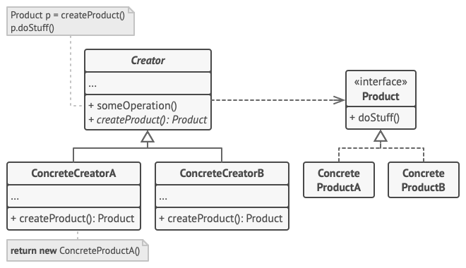
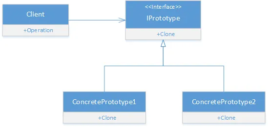
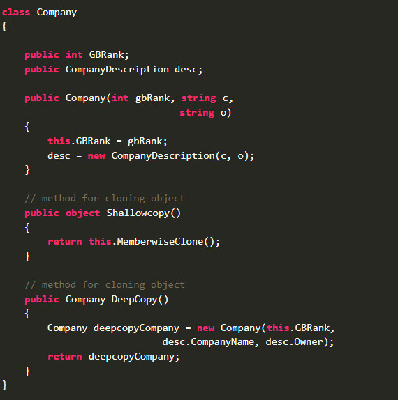

# Вбудовані шаблони проєктування на базі C#

## На що звернути увагу

- Вбудовані шаблони проєктування
- Приклади використання

## Спробуйте самі

- Singleton через Lazy<T>
- Спостерігач через event / IObservable
- Будівельник через StringBuilder
- Прототип через ICloneable
- Ітератор через IEnumerable

## Пов’язані лабораторні

- QnA з цієї лекції перетинається з [лабораторною №15 загального плану](../labs/general/lab-15-interview-questions.md).

---

# QnA🛡️

1. What are the four pillars of OOP?
2. Explain the concept of encapsulation in C# with an example.
3. How does inheritance work in C#?
4. What is polymorphism in C# and how can it be implemented?
5. Define and explain the use of interfaces in C#.
6. How does abstract class differ from an interface in C#?
7. What is the purpose of the **`virtual`** keyword in C#?
8. How do you override a method in C#?
9. Explain the concept of method overloading in C#.
10. What is the difference between method overloading and method overriding?
11. How is multiple inheritance achieved in C#?
12. Explain the role of the **`sealed`** keyword in C#.
13. What are properties in C# and how are they used?
14. How can you implement a read-only property in C#?
15. What is a static class in C# and when would you use one?
16. Explain the difference between a static method and an instance method.
17. What is a singleton class and how do you implement it in C#?
18. How does the **`this`** keyword work in C#?
19. What is the use of the **`base`** keyword in C#?
20. Describe the purpose of a constructor in C#.
21. How can you enforce encapsulation in C#?
22. Explain the concept of object cloning in C#.
23. What is shallow copy and deep copy in C#?
24. How can you implement deep copy in C#?
25. What are destructors in C# and when are they called?
26. How does garbage collection work in C#?
27. Explain the concept of boxing and unboxing in C#.
28. What are extension methods in C# and how are they used?
29. How can you implement an indexer in C#?
30. What are delegates and how are they used in C#?
31. Explain the concept of events in C# and how they differ from delegates.
32. How can you create and handle custom events in C#?
33. What is the Observer design pattern and how is it implemented in C#?
34. Explain the concept of generics in C#.
35. How do you define and use a generic class in C#?
36. What are constraints in generics and how are they applied in C#?
37. Explain the concept of covariance and contravariance in C#.
38. How do you implement a generic interface in C#?
39. What is reflection in C# and how can it be used?
40. How can you dynamically create an instance of a type using reflection?
41. Explain the role of attributes in C#.
42. How can you define and use custom attributes in C#?
43. What is the purpose of the **`Type`** class in C#?
44. How can you use the **`Activator`** class in C#?
45. Explain the concept of dependency injection and its benefits.
46. How do you implement dependency injection in C#?
47. What are the different types of dependency injection?
48. Explain the concept of inversion of control (IoC) in C#.
49. How do you use a dependency injection container in C#?
50. What is the purpose of the **`IDisposable`** interface in C#?
51. How do you implement the dispose pattern in C#?
52. Explain the difference between **`Dispose`** and **`Finalize`** methods in C#.
53. What are partial classes and how are they used in C#?
54. Explain the concept of partial methods in C#.
55. How can you use the **`dynamic`** keyword in C#?
56. What is the difference between **`dynamic`** and **`var`** in C#?
57. How does late binding work in C#?
58. Explain the concept of anonymous types in C#.
59. What are tuples and how are they used in C#?
60. How do you implement operator overloading in C#?
61. What are the benefits and drawbacks of operator overloading?
62. Explain the concept of nullable types in C#.
63. How can you use the null-coalescing operator in C#?
64. Explain the use of local functions in C#.
65. How do you implement a thread-safe singleton in C#?
66. What is the **`lock`** statement and how is it used in C#?
67. Explain the concept of thread pooling in C#.
68. How do you create and manage tasks in C#?
69. What is async/await in C# and how is it used?
70. Explain the purpose of the **`Task`** class in C#.
71. How do you handle exceptions in asynchronous methods?
72. What is the **`IEnumerable`** interface and how is it used in C#?
73. Explain the difference between **`IEnumerable`** and **`IEnumerator`** in C#.
74. What is the **`IQueryable`** interface and how does it differ from **`IEnumerable`**?
75. How can you create and use a custom collection in C#?
76. What are LINQ queries and how are they used in C#?
77. Explain the difference between LINQ to Objects and LINQ to Entities.
78. How do you implement a custom LINQ provider?
79. What is the **`Expression`** class in C# and how is it used?
80. How do you build and compile dynamic expressions in C#?
81. Explain the concept of dynamic language runtime (DLR) in C#.
82. What are anonymous methods and how are they used in C#?
83. How do you use lambda expressions in C#?
84. What is the **`Func`** delegate in C# and how is it used?
85. Explain the **`Action`** delegate and its uses in C#.
86. How do you create and use a multicast delegate in C#?
87. What is event bubbling and how is it handled in C#?
88. How do you implement an event aggregator in C#?
89. Explain the mediator pattern and its implementation in C#.
90. How do you create a fluent API in C#?
91. What is the repository pattern and how is it used in C#?
92. How do you implement the unit of work pattern in C#?
93. Explain the service locator pattern and its advantages and disadvantages.
94. How do you implement a CQRS (Command Query Responsibility Segregation) pattern in C#?
95. What is the difference between synchronous and asynchronous programming in C#?
96. How do you implement retry logic in C#?
97. What is the purpose of the **`yield`** keyword in C#?
98. What are the best practices for designing and implementing OOP systems in C#?
    1. KISS
    2. DRY
    3. SOLID
    4. IOC is must

1. **What are the SOLID principles and why are they important in software design?**
    - **Answer**: SOLID is an acronym that stands for five principles of object-oriented programming and design. These principles aim to make software designs more understandable, flexible, and maintainable. The principles are:
        1. Single Responsibility Principle (SRP)
        2. Open/Closed Principle (OCP)
        3. Liskov Substitution Principle (LSP)
        4. Interface Segregation Principle (ISP)
        5. Dependency Inversion Principle (DIP)
        They are important because they help in creating systems that are easier to manage and extend over time.
2. **Explain the Single Responsibility Principle (SRP) with an example.**
    - **Answer**: SRP states that a class should have only one reason to change, meaning it should have only one job or responsibility. For example, a class **`Invoice`** that handles both invoice processing and logging violates SRP. Instead, there should be two classes: **`InvoiceProcessor`** for processing invoices and **`InvoiceLogger`** for logging.
3. **How does the Open/Closed Principle (OCP) help in software development? Provide an example.**
    - **Answer**: OCP states that software entities (classes, modules, functions, etc.) should be open for extension but closed for modification. This means you can extend the behavior of a class without modifying its source code. For example, a **`PaymentProcessor`** class that uses an interface **`IPaymentMethod`** can be extended by adding new payment methods (e.g., **`CreditCardPayment`**, **`PaypalPayment`**) without changing the **`PaymentProcessor`** code.
4. **Describe the Liskov Substitution Principle (LSP) and provide an example where it might be violated.**
    - **Answer**: LSP states that objects of a superclass should be replaceable with objects of a subclass without affecting the correctness of the program. A violation occurs when a subclass alters behavior expected by the superclass. For example, if a **`Bird`** class has a method **`Fly`** and a subclass **`Penguin`** cannot fly, substituting a **`Penguin`** for a **`Bird`** would violate LSP.
5. **What is the Interface Segregation Principle (ISP) and why is it important?**
    - **Answer**: ISP states that no client should be forced to depend on methods it does not use. This means creating small, specific interfaces rather than a large, general-purpose one. It is important because it reduces the impact of changes and makes the code more understandable. For example, separating an interface **`IWorker`** into **`IWork`** and **`IEat`** to avoid classes implementing methods they do not need.
6. **Explain the Dependency Inversion Principle (DIP) with an example.**
    - **Answer**: DIP states that high-level modules should not depend on low-level modules; both should depend on abstractions (e.g., interfaces). Also, abstractions should not depend on details; details should depend on abstractions. For example, a **`ReportingService`** class should depend on an interface **`IReportGenerator`** rather than a concrete class **`PdfReportGenerator`**.
7. **How would you refactor a class that violates the Single Responsibility Principle?**
    - **Answer**: Identify the different responsibilities within the class and separate them into distinct classes. For example, if a **`UserService`** class handles both user data management and sending emails, create two separate classes: **`UserDataService`** for data management and **`EmailService`** for email functionality.
8. **Can you provide a real-world analogy to explain the Open/Closed Principle?**
    - **Answer**: Think of a smartphone. You can extend its functionality by installing new apps (extension) without needing to change the operating system code (modification). Similarly, in software, you should be able to add new features through extension rather than modifying existing code.
9. **Why is the Liskov Substitution Principle critical for polymorphism?**
    - **Answer**: LSP ensures that a subclass can stand in for its superclass without altering the expected behavior of the program. This is critical for polymorphism because it allows for flexible and interchangeable use of objects, maintaining the integrity of the codebase and avoiding unexpected behaviors.
10. **How does the Dependency Inversion Principle contribute to the decoupling of code?**
    - **Answer**: DIP encourages the use of interfaces or abstract classes rather than concrete implementations. This decouples the high-level and low-level modules, making the system more flexible and easier to maintain. Changes to low-level modules do not affect high-level modules as long as the contract (interface) remains the same.

These questions will help gauge a candidate's understanding of SOLID principles and their ability to apply them in real-world scenarios.

**Вбудовані шаблони проєктування в C#:**

Породжуючі:
- StringBuilder

- FactoryMethod — це породжувальний патерн проєктування, який визначає загальний інтерфейс для створення об’єктів у суперкласі, дозволяючи підкласам змінювати тип створюваних об’єктів.

[https://www.c-sharpcorner.com/article/factory-method-design-pattern-with-net-core/](https://www.c-sharpcorner.com/article/factory-method-design-pattern-with-net-core/)



```csharp
class MyOOPClass
{
	public int Score { get; set; }
}

internal class Program
{
	static void Main(string[] args)
	{
		var myClassNameAsString = "BuiltInPatterns.MyOOPClass";

		var handler = Activator.CreateInstance("BuiltInPatterns", myClassNameAsString);

		MyOOPClass obj = (MyOOPClass)handler.Unwrap();

		obj.Score = 10;

		Console.WriteLine("Hello, World!");
	}
}
```

- Прототип (System.ICloneable) — дозволяє копіювати об’єкти будь-якої складності без прив’язки до їхніх конкретних класів.



```csharp
class Car : ICloneable
{
	private int width;

	public Car(int width)
	{
		this.width = width;
	}

	public object Clone()
	{
		return new Car(this.width);
	}

	public override string ToString()
	{
		return string.Format("Width of car = {0}", this.width);
	}
}

internal class Program
{
	static void Main(string[] args)
	{
		Car carOne = new Car(1695);
		Car carTwo = (Car)carOne.Clone();

		Console.WriteLine("{0}mm", carOne);
		Console.WriteLine("{0}mm", carTwo);
	}
}
```

The MemberwiseClone method creates a shallow copy by creating a new object, and then copying the nonstatic fields of the current object to the new object. If a field is a value type, a bit-by-bit copy of the field is performed. If a field is a reference type, the reference is copied but the referred object is not; therefore, the original object and its clone refer to the same object.

[https://refactoring.guru/design-patterns/prototype/csharp/example](https://refactoring.guru/design-patterns/prototype/csharp/example)



IEnumerable - ітератор

IObservable \ event - behavioral design pattern that lets you define a subscription mechanism to notify multiple objects about any events that happen to the object they’re observing

```csharp
//https://leecampbell.com/2010/05/23/rx-part-2-static-and-extension-methods/
var range = Observable.Range(10, 15);
range.Subscribe(Console.WriteLine, () => Console.WriteLine("Completed"));

//-----------------

var enumT = new List<string>
{
	"a",
	"b",
	"c"
};
var fromEnum = enumT.ToObservable();

fromEnum.Subscribe(Console.WriteLine);
// --

var rnd = new Random();
var lastPrice = 100.0;
var interval = Observable.Interval(TimeSpan.FromMilliseconds(250))
	.Select(i =>
	{
		var variation = rnd.NextDouble() - 0.5;
		lastPrice += variation;
		return lastPrice;
	});

interval.Subscribe(Console.WriteLine);

Console.ReadLine();
```

Lazy<T> - singleton
