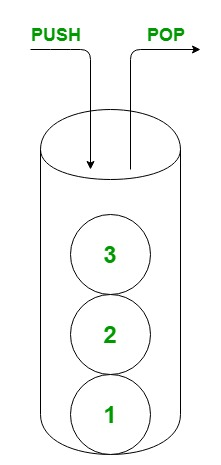

# Колекції в C#

## На що звернути увагу

- Завжди обирайте колекцію за типом доступу: чи потрібен вам індекс, ключ, унікальність, LIFO або FIFO.
- Пам’ятайте, що `Dictionary` стоїть на хеші, тому ваші методи `Equals` і `GetHashCode` обов’язково мають бути узгоджені.
- Використовуйте `HashSet` для унікальності без порядку, а `SortedSet` — коли потрібні і унікальність, і сортування.
- Беріть `Stack<T>` і `Queue<T>`, і ніколи не використовуйте старі негенерик типи.

## Спробуйте самі

- На одному наборі імен самостійно порівняйте роботу `List<T>`, `Dictionary<TKey,TValue>` та `HashSet<T>`.
- Порахуйте спрощений хеш рядка і спробуйте пояснити, звідки саме береться колізія.
- Зробіть механізм undo через стек і реалізуйте чергу задач через `Queue<T>`.

На лекції 02 ви вже бачили, чому колекції мають бути generic і як це прибирає boxing. Тому сьогодні ми не повторюємо `<T>`.

## Пов’язані лабораторні

- [Загальний план, №7](../labs/general/lab-07-generic-linked-list.md)
- [Індивідуальний план, №12](../labs/individual/lab-12-generic-linked-list.md)

---

Обирайте колекцію за тим, *як* ви будете до неї звертатися, а не ту, що першою спадає на думку.

Код до слайдів ви знайдете тут: `code/lecture-11-collections`.

## Пам’ятка: як обрати колекцію

- Якщо вам потрібен індекс і збереження порядку — беріть `List<T>`.
- Якщо ви шукаєте значення за ключем — ваш вибір `Dictionary<TKey, TValue>`.
- Якщо вам важлива лише унікальність — використовуйте `HashSet<T>`. А якщо елементи мають бути ще й відсортовані — беріть `SortedSet<T>`.
- Для принципу «останній зайшов — перший вийшов» обирайте `Stack<T>`. А для принципу «перший зайшов — перший вийшов» вам знадобиться `Queue<T>`.

## List&lt;T&gt;

Беріть список тоді, коли вам важливий порядок елементів, потрібен доступ за індексом і розмір колекції буде рости. Але пам’ятайте, що для пошуку за ключем список не підходить: вам доведеться йти по всіх елементах.

```csharp
var dirs = new List<string>(Directory.EnumerateDirectories(docPath));
foreach (var dir in dirs)
	Console.WriteLine(Path.GetFileName(dir));
```

На відміну від звичайного масиву, список вміє рости сам.

## Dictionary і хеш

`Dictionary<TKey, TValue>` зберігає пари ключ–значення. Пошук у ньому йде дуже швидко через хеш-код ключа. Зверніть увагу, що однакові ключі тут не допускаються.

Іноді трапляється **колізія**: це ситуація, коли різні ключі потрапляють в один кошик. Саме тому ваші методи `Equals` і `GetHashCode` завжди мають говорити одне й те саме: якщо два об’єкти рівні, їхні хеші теж обов’язково мають бути рівні.

Ось приклад спрощеного навчального хешу (звісно, у продакшені так не пишуть):

```csharp
static int ToyHash(string s, int buckets)
{
	var total = 0;
	foreach (var c in s)
		total += c;
	return total % buckets;
}
```

У реальному словнику під капотом викликається метод `GetHashCode` вашого ключа. Хеш також використовують для перевірки цілісності даних, але сьогодні нас цікавить лише швидкий доступ за ключем.

## HashSet і SortedSet

`HashSet<T>` — це невпорядкована множина унікальних елементів. Якщо ви спробуєте додати дублікат, він просто не додасться. Це дуже зручно для перевірок на кшталт «чи є вже такий тег» і для математичних операцій над множинами: об’єднання, перетину чи різниці.

`SortedSet<T>` теж зберігає лише унікальні елементи, але він завжди тримає їх відсортованими за зростанням. Вставка сюди обійдеться вам дорожче, натомість ви завжди маєте відсортований набір.

```csharp
var tags = new HashSet<string> { "oop", "csharp", "oop" }; // два елементи
var sorted = new SortedSet<int> { 30, 10, 20 };           // 10, 20, 30
```

Пам’ятайте, що порядок елементів у `HashSet` вам ніхто не обіцяє. Ніколи не намагайтеся сортувати його «на око».

## Stack і Queue



**Стек** працює за принципом LIFO: останній зайшов, перший вийшов. Він ідеально підійде вам для реалізації механізму undo, обходу в глибину або розбору дужок.

**Черга** працює за принципом FIFO: перший зайшов, перший вийшов. Використовуйте її для черги задач, обходу в ширину або фонових робіт.

```csharp
var undo = new Stack<string>();
undo.Push("type A");
undo.Push("type B");
var last = undo.Pop(); // type B

var jobs = new Queue<string>();
jobs.Enqueue("first");
jobs.Enqueue("second");
var next = jobs.Dequeue(); // first
```

У своїх нових проєктах завжди пишіть `Stack<T>` і `Queue<T>`. Старі класи `Stack` і `Queue` без `<T>` кладуть усе в `object` і повертають нам проблему boxing, яку ви розбирали на лекції 02.
