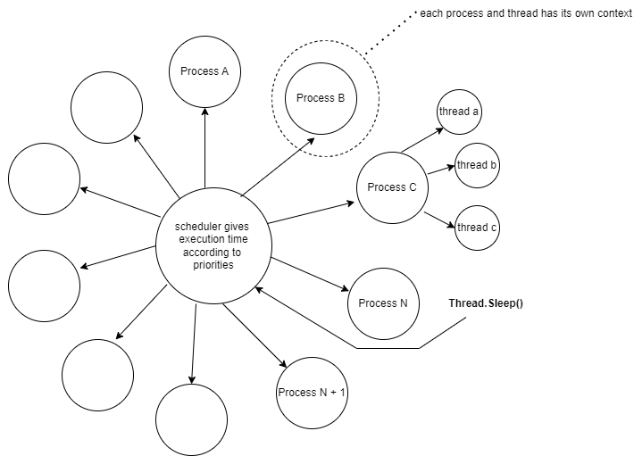

# Багатопотоковість у C#

## На що звернути увагу

- Потоки, ThreadPool, синхронізація, TPL / async

## Спробуйте самі

- Створення потоків
- Проблема синхронізації
- Асинхронне програмування

## Пов’язані лабораторні

- Окремої нумерованої лабораторної немає; тему варто зв’язати з thread-safety одинака (`Lazy<T>`).

---

# Історія багатозадачності🛡️

Однопроцесорні операційні системи та витісняльна багатозадачність

Приклад однопроцесорної операційної системи Windows 95 



Деталі про процеси та потоки: [https://www.geeksforgeeks.org/difference-between-process-and-thread/](https://www.geeksforgeeks.org/difference-between-process-and-thread/)

## Багатозадачність в C#

### Створюємо потоки

У кожного процесу є головний потік програми.

```csharp
using System;
using System.Threading;

class Program
{
	static void Main()
	{
		// створюємо новий поітк
		Thread t = new Thread(Worker);

		// запускаємо потік - неблокує основний потік програми
		t.Start();

		// емулюємо роботу в основному потоці
		for (int i = 0; i < 10; i++)
		{
			Console.WriteLine("Main thread doing some work");
			Thread.Sleep(100);
		}

		// чекаємо поки головний потік завершить виконання
		t.Join();

		Console.WriteLine("Done");
	}

	static void Worker()
	{
		for (int i = 0; i < 10; i++)
		{
			Console.WriteLine("Worker thread doing some work");
			Thread.Sleep(100);
		}
	}
}

```

### ThreadPool

У C# ThreadPool - це керований пул потоків, наданий .NET Framework для ефективного управління та повторного використання потоків. Він дозволяє виконувати асинхронні та паралельні операції без явного створення та управління потоками самостійно. ThreadPool часто використовується для виконання непродовжуваних завдань або дій в багатопотоковому середовищі для покращення продуктивності та використання ресурсів.

```csharp
using System;
using System.Threading;

class Program
{
	static void Main()
	{
		// queue a work item to the thread pool
		ThreadPool.QueueUserWorkItem(Worker, "Hello, world!");

		// do some other work in the main thread
		for (int i = 0; i < 10; i++)
		{
			Console.WriteLine("Main thread doing some work");
			Thread.Sleep(100);
		}

		Console.WriteLine("Done");
	}

	static void Worker(object state)
	{
	Console.WriteLine("Thread: {0}", Thread.CurrentThread.ManagedThreadId);
		string message = (string)state;

		for (int i = 0; i < 10; i++)
		{
			Console.WriteLine(message);
			Thread.Sleep(100);
		}
	}
}

```

## Проблема синхронізації між потоками

[https://www.javatpoint.com/c-sharp-thread-synchronization](https://www.javatpoint.com/c-sharp-thread-synchronization)

Синхронізація — це техніка, що дозволяє лише одному потоку отримати доступ до ресурсу протягом певного часу. Жоден інший потік не може перервати його доти, доки призначений потік не завершить своє завдання.

У програмі з багатопотоковістю потокам дозволяється отримувати доступ до будь-якого ресурсу протягом необхідного часу виконання. Потоки діляться ресурсами та виконуються асинхронно. Доступ до спільних ресурсів (даних) є критичним завданням, що іноді може зупинити систему. Ви вирішуєте це, зробивши потоки синхронізованими.

Це головним чином використовується у випадку транзакцій, таких як внесення коштів, зняття коштів тощо. 

Приклад з відсутньою синхронізацією:

```csharp
using System;  
using System.Threading;  
class Printer  
{  
    public void PrintTable()  
    {  
        for (int i = 1; i <= 10; i++)  
        {  
            Thread.Sleep(100);  
            Console.WriteLine(i);  
        }  
    }  
}  
class Program  
{  
    public static void Main(string[] args)  
    {  
        Printer p = new Printer();  
        Thread t1 = new Thread(new ThreadStart(p.PrintTable));  
        Thread t2 = new Thread(new ThreadStart(p.PrintTable));  
        t1.Start();  
        t2.Start();  
    }  
}  
```

Приклад з примітивом синхронізації lock

```csharp
using System;  
using System.Threading;  
class Printer  
{  
    public void PrintTable()  
    {  
        lock (this)  
        {  
            for (int i = 1; i <= 10; i++)  
            {  
                Thread.Sleep(100);  
                Console.WriteLine(i);  
            }  
        }  
    }  
}  
class Program  
{  
    public static void Main(string[] args)  
    {  
        Printer p = new Printer();  
        Thread t1 = new Thread(new ThreadStart(p.PrintTable));  
        Thread t2 = new Thread(new ThreadStart(p.PrintTable));  
        t1.Start();  
        t2.Start();  
    }  
}  
```

lock - [https://learn.microsoft.com/en-us/windows/win32/sync/condition-variables?redirectedfrom=MSDN](https://learn.microsoft.com/en-us/windows/win32/sync/condition-variables?redirectedfrom=MSDN)

mutex

semaphore

## Асинхронне програмування та TPL

[https://learn.microsoft.com/en-us/dotnet/standard/asynchronous-programming-patterns/task-based-asynchronous-pattern-tap?redirectedfrom=MSDN](https://learn.microsoft.com/en-us/dotnet/standard/asynchronous-programming-patterns/task-based-asynchronous-pattern-tap?redirectedfrom=MSDN)

[https://medium.com/@nirajranasinghe/understanding-concurrency-in-c-with-threads-tasks-and-threadpool-4c80f6e03df9](https://medium.com/@nirajranasinghe/understanding-concurrency-in-c-with-threads-tasks-and-threadpool-4c80f6e03df9)

**Завдання проти Потоку: Основні відмінності**
Хоча завдання та потоки обидва представляють собою одиниці роботи, вони відрізняються у кількох ключових аспектах:

**Модель виконання:** Потоки керуються операційною системою, тоді як завдання керуються середовищем виконання.

**Управління ресурсами:** Потоки потребують явного управління ресурсами, тоді як завдання керуються середовищем виконання.

**Обробка винятків:** Винятки на основі потоків можуть бути важкими для обробки, тоді як завдання забезпечують структурований підхід до обробки винятків.

```csharp
using System;
using System.Threading.Tasks;

class Program
{
    static async Task Main()
    {
        // створюємо таску
        Task task1= Task.Run(() => Console.WriteLine("Doing some work in a task."));

        // чекаємо виконання
        await task1;

        Console.WriteLine("Task completed!");
    }
}
```

[https://blog.stephencleary.com/2012/02/async-and-await.html](https://blog.stephencleary.com/2012/02/async-and-await.html)
