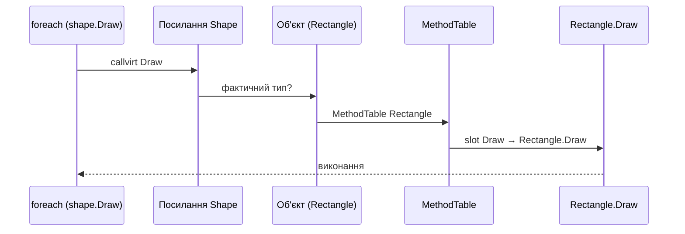

# Додаткові нотатки: лекція 01 — теорія ООП

Прочитайте ці нотатки після основної лекції про ООП, якщо ви хочете зібрати всі модифікатори доступу в одну зручну таблицю.

Пов’язано:

- [Конспект лекції](../lectures/01-oop-theory.md)
- [HTML-презентація](../presentations/01-oop-theory.html)
- [Код: поліморфізм](../../code/lecture-01-oop-theory/Demos/PolymorphismDemo.cs)

---

## 1. Модифікатори доступу в C#

Модифікатори визначають, **хто** може звернутися до поля, властивості чи методу. Це технічна основа **інкапсуляції**.

### За замовчуванням

| Оголошення | Модифікатор за замовчуванням |
|---|---|
| Член класу (поле, метод, властивість) | `private` |
| Тип верхнього рівня (class, struct, interface) | `internal` |
| Член інтерфейсу | `public` |

### Усі модифікатори — зведена таблиця

| Модифікатор | Той самий клас | Похідний клас (той самий assembly) | Похідний клас (інший assembly) | Будь-який код у тому самому assembly | Будь-який код в іншому assembly |
|---|---|---|---|---|---|
| `private` | ✓ | ✗ | ✗ | ✗ | ✗ |
| `private protected` | ✓ | ✓ | ✗ | ✗ | ✗ |
| `protected` | ✓ | ✓ | ✓ | ✗ | ✗ |
| `internal` | ✓ | ✓ | ✗ | ✓ | ✗ |
| `protected internal` | ✓ | ✓ | ✓ | ✓ | ✗ |
| `public` | ✓ | ✓ | ✓ | ✓ | ✓ |
| `file` *(C# 11+)* | ✓ *(лише типи в тому самому `.cs` файлі)* | — | — | — | — |

**Як читати комбінації:**

- **`protected internal`** — доступ, якщо виконується **хоча б одна** умова: ви в похідному класі **або** в тому самому assembly.
- **`private protected`** — доступ, якщо виконуються **обидві** умови: ви в похідному класі **і** в тому самому assembly.

### Короткі формулювання

| Модифікатор | Одним реченням |
|---|---|
| `public` | Доступний усім |
| `private` | Лише всередині класу, що оголосив член |
| `protected` | Клас + усі похідні класи (навіть у інших збірках) |
| `internal` | Будь-хто в межах однієї збірки (assembly / проєкт) |
| `protected internal` | Похідні **або** код у тій самій збірці |
| `private protected` | Похідні **в тій самій** збірці |
| `file` | Лише код у тому самому файлі |

### Приклад для дошки

```csharp
internal class Base
{
    private int a = 1;
    protected int b = 2;
    internal int c = 3;
    public int d = 4;
}

internal class Derived : Base
{
    void Demo()
    {
        // a++;  // помилка: private недоступний
        b++;     // OK: protected
        c++;     // OK: internal (той самий assembly)
        d++;     // OK: public
    }
}
```

### Що підкреслити студентам

1. **`private` у базовому класі** — похідний клас **не бачить** цей член напряму (лише через `public`/`protected` API базового класу).
2. **`internal`** — не «приховано від усіх», а «видно в межах проєкту». Це зручно для тестів і допоміжних типів у тій самій збірці.
3. Публічна **властивість** ≠ публічне **поле**: через властивість можна додати валідацію пізніше — інкапсуляція не порушується.

---

## 2. Динамічний поліморфізм і віртуальні таблиці (vtable)

На основній лекції ми показали `virtual` / `override` і виклик через змінну базового типу. Тут — **що відбувається під капотом**.

### Статичний vs динамічний вибір методу

| | Статичний (compile-time) | Динамічний (runtime) |
|---|---|---|
| Приклад | Перевантаження: `Add(int)`, `Add(double)` | `virtual` / `override`: `Shape.Draw()` |
| Хто обирає метод | Компілятор | CLR за **фактичним типом об’єкта** |
| IL-інструкція | `call` | `callvirt` |

```csharp
Shape shape = new Rectangle(ConsoleColor.Blue);
shape.Draw(); // викликеться Rectangle.Draw(), не Shape.Draw()
```

Компілятор знає лише, що у `shape` є метод `Draw`. **Яку саме** реалізацію виконати — вирішує runtime.

### Спрощена модель пам’яті об’єкта

Кожен **екземпляр** у купі (heap) містить:

1. **Заголовок об’єкта** — службова інформація (у т.ч. посилання на тип).
2. **Поля екземпляра** — `Width`, `Height`, `BorderColor` тощо.

Тип (`Rectangle`, `Triangle`, …) описує **Method Table** — таблицю методів (у літературі часто кажуть **vtable**, virtual method table).

```
┌─────────────────────────────────────────────────────────────┐
│  Змінна базового типу          Об’єкт у пам’яті (heap)      │
│                                                             │
│  Shape shape ───────────────►  [ sync block / header ]      │
│                                [ → MethodTable Rectangle ]  │
│                                [ поля Rectangle... ]        │
└─────────────────────────────────────────────────────────────┘
```

### Method Table для ієрархії

```
MethodTable "Shape"
┌──────────────────┬─────────────────────┐
│ Draw             │ → Shape.Draw        │  ← slot 0
│ ToString         │ → Object.ToString   │
└──────────────────┴─────────────────────┘

MethodTable "Rectangle" : Shape
┌──────────────────┬─────────────────────┐
│ Draw             │ → Rectangle.Draw    │  ← override замінив slot
│ ToString         │ → Object.ToString   │
└──────────────────┴─────────────────────┘

MethodTable "Triangle" : Shape
┌──────────────────┬─────────────────────┐
│ Draw             │ → Triangle.Draw     │
│ ToString         │ → Object.ToString   │
└──────────────────┴─────────────────────┘
```

Ключова ідея: **`override` не створює новий метод «поруч»** — він **підміняє запис у таблиці** для цього типу (і нащадків, якщо вони знову не override).

### Покроково: `shape.Draw()`

```csharp
List<Shape> shapes =
[
    new Rectangle(ConsoleColor.Blue),
    new Triangle(ConsoleColor.Yellow),
];

foreach (var shape in shapes)
{
    shape.Draw();
}
```

Для **кожної** ітерації:

```
1. shape — посилання типу Shape, але вказує на конкретний об’єкт (Rectangle або Triangle).

2. Компілятор генерує callvirt Draw — «виклик віртуального методу».

3. Runtime дивиться на MethodTable реального об’єкта:
      Rectangle → Rectangle.Draw
      Triangle  → Triangle.Draw

4. Виконується знайдена реалізація (можна намалювати різні фігури в консолі).
```



### Що якщо метод не virtual?

```csharp
class A
{
    public void M() => Console.WriteLine("A");
}

class B : A
{
    public new void M() => Console.WriteLine("B"); // приховування, не override
}

A obj = new B();
obj.M(); // виведе "A" — вибір на етапі компіляції (call), vtable не використовується
```

| Ключове слово | Ефект |
|---|---|
| `virtual` + `override` | Динамічний поліморфізм через vtable |
| `new` | Приховування; вибір за **типом змінної**, не об’єкта |
| без `virtual` | Перевизначити справжній поліморфізм у нащадка не вийде |

### `sealed override`

```csharp
public sealed override void Draw() { ... }
```

Забороняє **далі** перевизначати цей метод у нащадках. Запис у vtable для типів нижче зафіксований.

### Демонстрація в коді курсу

Запустіть приклад поліморфізму:

```powershell
cd code
dotnet run --project lecture-01-oop-theory
```

Секція **Polymorphism** — два різні `Draw()` через одну змінну `Shape`. На дошці паралельно покажіть: «компілятор бачить `Shape`, runtime бачить `Rectangle` / `Triangle`».

### Питання для аудиторії

1. Чому `ToString()` на `Student` викликає перевизначену версію, хоча змінна типу `Person`? *(віртуальний метод з `Object`)*
2. Чим відрізняється overload `Add(2, 3)` і `Add(2.1, 5.7)` від `shape.Draw()` для різних фігур?
3. Що станеться, якщо прибрати `virtual` у `Shape.Draw()`?

### Короткий підсумок

- **Інкапсуляція** — модифікатори доступу задають видимість членів.
- **Динамічний поліморфізм** — один виклик через базовий тип, різна поведінка через **Method Table** фактичного типу.
- **`virtual` / `override`** — домовленість між кодом і CLR: «вибери реалізацію під час виконання».
